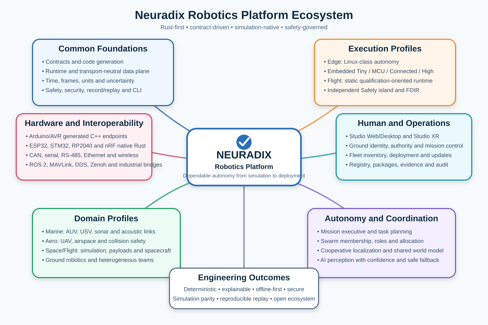

# Neuradix Robotics Platform

Neuradix is a Rust-first, contract-driven robotics development and operations platform: design, program, control, simulate, test, deploy and operate systems across compatible hardware, from tiny Arduino devices to enterprise infrastructure. Classical control, automation, autonomy and optional AI share one engineering model.

The target architecture uses Tiny, MCU, Edge, Workstation and Enterprise execution profiles, with shared contracts, identities, clocks and diagnostics. Profile-specific code generation, executors and device bindings adapt to hardware capabilities. This is the product direction; current implementation remains a foundation prototype.



## Current documentation

- [Documentation index and precedence](docs/README.md)
- [Product, Functional and Technical Specification v0.6](docs/Neuradix_Robotics_Platform_Functional_Specification_v0.6.md) — proposed authoritative specification
- [Detailed Implementation Plan v0.4](docs/Neuradix_Implementation_Plan_v0.4.md) — 38 work packages, dependencies, estimates and acceptance evidence
- [Review and Strategy v1.0](docs/Neuradix_Robotics_Platform_Review_and_Strategy_v1.0.md)
- [Current capability and evidence status](docs/Neuradix_Capability_Status.md)
- [Embedded Plan v0.2](docs/Neuradix_Embedded_Profile_Implementation_Plan_v0.2.md), [Studio Plan v0.2](docs/Neuradix_Studio_Implementation_Plan_v0.2.md), [CLI Specification v0.2](docs/Neuradix_CLI_Command_Specification_v0.2.md)
- [RFC Backlog v0.4](docs/Neuradix_RFC_Backlog_v0.4.md), [architecture RFCs](docs/rfcs/), [decision records](docs/decisions/)

## Implementation status

Main `e39da5e` implements scalar contract parsing/validation/hash and Rust generation; tagged clocks; bounded in-process streams; lifecycle and input-driven lockstep execution; native recording and digest; scalar authority/constraints/lineage/FDIR; supervised Python processes; offline graph validation; CLI and test utilities.

The reviewed development branch [`claude/gifted-albattani-i7t2wc` at `c8aa467`](https://github.com/KevinBusuttil/neuradix-robotics-platform/tree/c8aa4671bcee8739354beb7880551db7f64314fa) is six commits ahead. It adds a one-dimensional closed-loop AUV model, handwritten MCAP backend, headless Studio inspection, no_std embedded primitives, serial framing and fixed scalar Rust/C++ generation. These additions are not part of main until reviewed and integrated.

Current limits:

- `replay run` verifies recorded-data integrity; the runtime lockstep test separately re-executes a processor. There is no CLI runner for an arbitrary changed deployment graph.
- Graph validation checks declarations; it does not launch a runtime supervisor or prove physical actuator enforcement. The current deployment hash does not fully pin resolved behaviour.
- Python process separation and request timeout logic do not yet bound all I/O, cleanup and resources.
- Development MCAP is a private subset; host C++/no_std conformance is not actual Arduino/MCU deployment evidence.
- Graphical Studio, integrated general simulation, physical board build/flash, native networking/shared memory, ROS/MAVLink bridges, worker clusters and fleet/AI/XR integrations remain planned.

[Capability Status](docs/Neuradix_Capability_Status.md) records the open identity, AVR, safety, worker and interchange findings with work-package ownership. Historical CI success is not a fresh hardware, timing or scalability validation. The documentation update does not fix those code issues.

## Prerequisites

- Rust toolchain **1.94.1** (pinned in `rust-toolchain.toml`; `rustup` installs it
  automatically). Edition 2024.
- `python3` (optional) — only for the `neuradix-python` worker tests and the
  `python-worker` example; those tests skip cleanly when it is absent.

## Build and test

```bash
cargo build --workspace
cargo test  --workspace
cargo fmt   --all --check
cargo clippy --workspace --all-targets -- -D warnings
cargo doc   --workspace --no-deps
```

## CLI examples

```bash
# Validate a contract (exit code 3 on failure); machine-readable output:
cargo run -p neuradix-cli -- --output json contract validate contracts/standard/navigation/vehicle-depth.yaml

# Print the content-addressed schema identity:
cargo run -p neuradix-cli -- contract hash contracts/standard/navigation/vehicle-depth.yaml

# Inspect the parsed contract:
cargo run -p neuradix-cli -- contract inspect contracts/standard/navigation/vehicle-depth.yaml

# Generate the Rust projection:
cargo run -p neuradix-cli -- contract generate contracts/standard/navigation/vehicle-depth.yaml \
    --language rust --out-dir /tmp/nrx-generated

# Environment diagnostics:
cargo run -p neuradix-cli -- doctor

# The example writes recordings to temp files; inspect, replay and explain them:
cargo run -p neuradix-example-minimal-depth-stream   # prints the .nrec paths + digest
cargo run -p neuradix-cli -- record inspect /tmp/neuradix-depth-mission.nrec
cargo run -p neuradix-cli -- replay run /tmp/neuradix-depth-mission.nrec --expect-digest <sha256:...>

# Explain the causal chain (sensor -> control -> authority/constraints -> applied)
# of the command nearest a given time:
cargo run -p neuradix-cli -- explain command /tmp/neuradix-depth-lineage.nrec --at 450000000

# Validate a deployment manifest offline (exit code 10 on failure); reports the
# content-addressed deployment identity and every topology/policy issue:
cargo run -p neuradix-cli -- graph validate examples/reference-auv/deployment.yaml

# ...and resolve every wired contract reference to a real, registered schema
# (reports the sha256: schema identity each reference pins):
cargo run -p neuradix-cli -- graph validate examples/reference-auv/deployment.yaml \
    --contracts contracts/standard
```

## Examples

```bash
# The full deterministic vertical slice (contract -> stream -> control -> safety
# -> record -> replay -> explain -> FDIR):
cargo run -p neuradix-example-minimal-depth-stream

# An isolated Python worker: detection, a Python crash that is isolated and
# drives FDIR to a safe mode, then a supervised restart (requires python3):
cargo run -p neuradix-example-python-worker
```

It loads the authored contract, derives the stream's capacity and overflow policy
from it, moves a producer and consumer through valid lifecycle states, stamps each
sample with a domain-tagged timestamp from a deterministic clock, exercises the
bounded-stream overflow policy, and prints stream statistics before terminating
deterministically.

## Repository layout

```text
crates/
  contracts/        # neuradix-contracts: model, validation, identity, codegen
  time/             # neuradix-time: clock domains, timestamps, clocks
  transport-api/    # neuradix-transport-api: bounded stream, backend-neutral
  runtime/          # neuradix-runtime: component + lifecycle + deterministic executor
  record/           # neuradix-record: deterministic recording + replay digest
  safety/           # neuradix-safety: authority, constraints, decisions, FDIR
  python/           # neuradix-python: isolated Python worker supervision
  graph/            # neuradix-graph: offline deployment topology + policy compiler
  cli/              # neuradix-cli: the `neuradix` binary
  testkit/          # neuradix-testkit: reusable test utilities
python/             # neuradix_worker.py: the Python-side worker library
contracts/standard/ # authored standard contracts (navigation, perception, control, actuation)
examples/           # minimal-depth-stream, python-worker, reference-auv (deployment manifest)
docs/rfcs/          # architecture RFCs
docs/decisions/     # architecture decision records (ADRs)
```

## Current implementation priority

Follow [Gates A–E](docs/Neuradix_Implementation_Plan_v0.4.md#3-gates-dependencies-and-effort): trustworthy foundations; one compiled project across actual Uno/MCU and Edge; integrated simulation/Studio/HIL; distributed workers; then a qualified supported workflow. Preserve the AUV fixture as a fast regression. Domain, enterprise HA, broader fleet, AI, Swarm, XR and Flight packs have separate Gate F milestones.

Current commands above run against main. New project/build/flash/simulation/job operations described in the CLI specification are proposed until the capability register and release evidence say otherwise.
