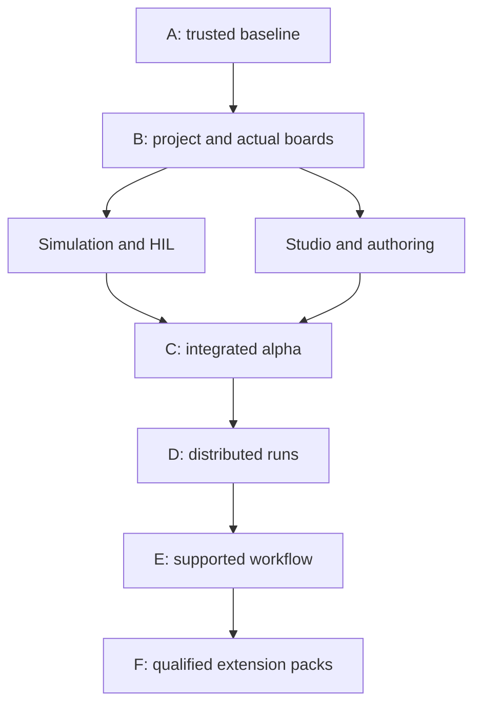

# 1. Purpose and authority

Implement the [Review and Strategy v1.0](Neuradix_Robotics_Platform_Review_and_Strategy_v1.0.md) and [Functional Specification v0.6](Neuradix_Robotics_Platform_Functional_Specification_v0.6.md) as a unified robotics development and operations platform from Arduino to enterprise. AI is optional. This plan supersedes the earlier AUV-first/embedded-later sequence and the earlier AI-workbench estimate.

This is the current planning baseline, with delivery evidence tracked in [Capability Status](Neuradix_Capability_Status.md). [PR #7](https://github.com/KevinBusuttil/neuradix-robotics-platform/pull/7) integrated the six development increments and the [PR #6](https://github.com/KevinBusuttil/neuradix-robotics-platform/pull/6) codec fixes into main at `d5fbd69b7b901ad8899b9c911ad09e265ff76636`. The [first Gate A increment](implementation/Gate-A-Embedded-Wire-and-ABI.md) has passing host and AVR compiler evidence. WP-A01/A02/A03 remain partial; Gate A is open. Estimates below retain the original planning basis and must be revised from measured remaining work rather than treating one merged increment as a completed work package.

The acceptance horizon is one complete instrumented system spanning an actual Uno, one 32-bit MCU, Edge, integrated simulation/Studio and distributed workers. Broader domain and enterprise packs remain part of the programme through Gate F with their own release evidence.

# 2. Planning defaults and decision ownership

| Decision | Working default | Validation/change point |
|---|---|---|
| Tiny | Arduino Uno R3, generated bounded C++ and Arduino CLI | WP-A03/B05 must prove ABI, build and physical conformance |
| Native MCU | One RP2040 board; static executor first | WP-B04 may substitute a board with recorded rationale and equivalent acceptance coverage |
| Reference system | Instrumented motor/sensor rig or small mobile robot; retain AUV fixture | WP-C05 records actual sensors, safe state, calibration and operating envelope |
| Host | One supported Linux distribution/architecture first | WP-E03 publishes the exact tested host/toolchain matrix |
| Simulation | Native Neuradix API, headless Gazebo backend, fast AUV fixture | WP-C01/C02 qualify stepping, imports, assets and fidelity |
| Studio | Local web UI plus shared Rust application/query services | WP-C03 records renderer/desktop decisions after a bounded performance spike |
| Communication | Bounded local channels, serial board gateway, Zenoh network candidate | WP-B06/D03 qualify transport behaviour; shared memory follows a measured need |
| Recording | Maintained MCAP implementation plus Neuradix metadata | WP-A06 validates independent interchange and limits |
| Server execution | Local worker, then two servers; optional Kubernetes adapter | WP-D01/D04 preserve run semantics; F01 qualifies enterprise availability |
| Languages | Rust trusted core, generated C/C++ on constrained targets, isolated host C++/Python extensions | Capability and ABI declarations govern placement |

The platform lead owns architectural integration; each work package has a role owner and an independent reviewer. Role labels do not assume additional employees. Procurement, dedicated staffing and access to physical test equipment are planning inputs, not actions performed by this documentation update.

# 3. Gates, dependencies and effort

| Gate | Outcome | Work packages | Effort (engineer-weeks) |
|---|---|---|---|
| A | Trustworthy baseline | WP-A01, WP-A02, WP-A03, WP-A04, WP-A05, WP-A06, WP-A07, WP-A08 | 9–17 |
| B | Cross-target foundation | WP-B01, WP-B02, WP-B03, WP-B04, WP-B05, WP-B06, WP-B07 | 17–31 |
| C | Integrated alpha | WP-C01, WP-C02, WP-C03, WP-C04, WP-C05, WP-C06 | 18–32 |
| D | Distributed alpha | WP-D01, WP-D02, WP-D03, WP-D04 | 11–19 |
| E | Supported first release | WP-E01, WP-E02, WP-E03, WP-E04, WP-E05 | 14–25 |

Engineer-week estimates are original rough planning ranges for remaining implementation, integration, focused tests and package documentation. They assume competent contributors familiar with the code, available reference hardware and substantial reuse of existing foundations. They exclude general support/consulting interruptions, procurement lead time, certification, broad ecosystem parity and Gate F.

The A–E total is **69–124 engineer-weeks**. With two engineers at 70% allocation, effective capacity is 1.4 engineer-weeks per calendar week: approximately **49–89 calendar weeks** before additional procurement or external pilot delays. This is a capacity scenario, not a committed release date. One engineer at the same allocation implies approximately 99–178 weeks. Re-estimate after A and after the first board/simulator spikes; use actual available capacity rather than assuming two full-time resources.

The critical path is A02/A03/A04/A08 → B01/B02/B03 → board/gateway/Edge integration → simulation/Studio/HIL → distributed run evidence → release qualification. Independent packages may overlap only after their interface dependencies are stable. Dependencies below refer to implementation completion needed for acceptance; design/spike work may begin earlier without claiming the dependent package complete.

# 4. First 90 days: capacity-limited execution plan

At the two-person/70% scenario, a 12-week planning window provides about 16.8 engineer-weeks. Reserve roughly 12–15 for foundation fixes and early compiler/board integration, with the balance for review and discovered rework. The upper A estimate alone exceeds that capacity; therefore B–C completion is not a 90-day commitment.

| Window | Primary work | Parallel investigation | Review evidence |
|---|---|---|---|
| Weeks 1–2 | A01; reproduce identity, AVR and authority defects; choose integration baseline | Define rig, available boards and package owners | Reproduction fixtures, chosen targets and updated estimates |
| Weeks 3–4 | A02/A03/A04 fixes and target ABI checks | B01 project example; MCAP/worker edge-case fixtures | Reviewed protocol/authority decisions; actual target compilation |
| Weeks 5–6 | A05/A06/A08; A07 runner as capacity permits | Board HAL/static-loop spike; simulator API sketch | Bounded I/O/interchange/identity evidence; first board measurements |
| Weeks 7–8 | Close remaining A work; start B01/B02 | One serial/board session and initial Studio data view | Gate A review; immutable project/identity example |
| Weeks 9–10 | B02/B03 and first B04/B05 integration according to measured progress | Gazebo stepping/import spike and Studio service contract | Placement errors, clock/reboot results and simulator decision record |
| Weeks 11–12 | Integrate the achievable board/control path; repair failures | Draft C01/C03 boundaries and next work orders | Retained physical evidence where executed; revised B–E backlog and capacity forecast |

Each review explicitly marks not-run hardware tests and unfinished work. If A exceeds available capacity, move downstream work rather than weakening the correctness gate or relabelling a prototype as complete.

# 5. Work package execution contract

For each package: open a bounded implementation PR referencing the WP ID, preserve unrelated code, include focused acceptance evidence, update affected RFCs/reference docs and the capability register, and retain artifact/test identities. Gate completion requires applicable cross-package acceptance tests, not only unit tests within the changed crate. Do not scaffold empty future subsystems as evidence of progress.

## WP-A01: Baseline and evidence

**Gate:** A · **Owner role:** Platform lead · **Dependencies:** None · **Estimate:** 1–2 engineer-weeks.

**Deliver:** Review the six development commits independently; inventory retained crates, examples and RFCs; select a reviewed integration baseline. Record exact toolchain and CI prerequisites. Keep main/development status separate until code is integrated.

**Acceptance:** A maintainer can map every claimed capability to a commit, example and test result. Python, C++ and board checks explicitly report executed, failed or unavailable; required release checks cannot silently skip.

**Primary risk:** Unreviewed prototype work being described as supported functionality.

**Progress:** Development and codec fixes are integrated through PR #7; exact baseline and compiler evidence are recorded in Capability Status. Finish the broader evidence inventory and optional-tool audit.

## WP-A02: Semantic and wire identities

**Gate:** A · **Owner role:** Contracts/runtime · **Dependencies:** [WP-A01](#wp-a01) · **Estimate:** 1–2 engineer-weeks.

**Deliver:** Define semantic schema identity separately from ordered wire layout, codec and codec version. Canonicalise layout or pin an explicit layout identity. Specify compatibility, compact endpoint-ID resolution and collision handling.

**Acceptance:** Two independently generated endpoints from reordered equal-width fields either decode identically or reject a layout mismatch. Mixed codec versions and ID collisions cannot silently decode data. Preserve a migration fixture for existing recordings.

**Primary risk:** Fixing a hash without versioning existing encoded data.

**Progress:** Canonical v2 scalar layout, full wire identity, manifests and identity-aware decoders are integrated. Reordered independent endpoints and codec mismatch rejection pass. Transport binding, compact-ID collision enforcement and existing-recording migration remain open.

## WP-A03: Target-aware numeric projections

**Gate:** A · **Owner role:** Embedded · **Dependencies:** [WP-A01](#wp-a01), [WP-A02](#wp-a02) · **Estimate:** 1–2 engineer-weeks.

**Deliver:** Add target ABI/representation capabilities to C/C++ generation. Check byte width and numeric representation; define supported binary32, integers and bool. Reject unsupported binary64 on standard AVR or introduce an explicit conversion/codec with declared precision.

**Acceptance:** Actual Uno-toolchain builds reject unsupported binary64 safely. Board-generated supported payloads match host golden vectors, including boundaries, non-finite values where allowed and endianness. No eight-byte copy targets a four-byte double.

**Primary risk:** Host compiler conformance hiding AVR memory corruption.

**Progress:** Uno numeric selection and actual AVR compile/link/rejection tests are integrated. Host boundary vectors pass. Physical Uno vectors, stack/timing measurements and the selected native MCU profile remain open.

## WP-A04: Trusted command evaluation and finite limits

**Gate:** A · **Owner role:** Safety/runtime · **Dependencies:** [WP-A01](#wp-a01) · **Estimate:** 1–2 engineer-weeks.

**Deliver:** Authorize using trusted evaluation time; validate source age, lease epoch, sequence and deadline separately. Make invariant-bearing configuration private. Reject invalid numeric inputs and bounds; validate safe values and final output. Align host and embedded slew semantics in physical units per time.

**Acceptance:** Expired, stale, duplicate, future-skewed and non-finite commands produce a specified outcome. Tests cover reboot/lease epoch, NaN limits and changing evaluation periods. The chosen rig documents its actual safe response.

**Primary risk:** Confusing sender timestamps or CRC with trusted authority.

## WP-A05: Bounded extension processes

**Gate:** A · **Owner role:** Runtime/SDK · **Dependencies:** [WP-A01](#wp-a01) · **Estimate:** 1–2 engineer-weeks.

**Deliver:** Bound protocol lines, queues and outstanding requests. Apply one deadline across write, read and cleanup; prevent blocking waits on a live child. Implement heartbeat health, process-tree termination and resource-limit policy with explicit OS support.

**Acceptance:** Workers that never read stdin, flood stdout, close stdout while remaining alive, hang or spawn children cannot indefinitely block the supervisor or grow queues without bound. Recovery obeys the restart budget.

**Primary risk:** Process separation being mistaken for complete resource or security isolation.

## WP-A06: MCAP interchange and bounded recording

**Gate:** A · **Owner role:** Data/recording · **Dependencies:** [WP-A01](#wp-a01) · **Estimate:** 2–3 engineer-weeks.

**Deliver:** Adopt a maintained MCAP implementation behind the existing recording interface. Preserve full schemas, encodings, source/log times and Neuradix metadata. Support streaming and independently produced chunked/compressed fixtures; define limits for unsupported encodings.

**Acceptance:** Independent writers and readers agree on messages, payloads, schemas and timestamps. Unsupported data is explicitly rejected or retained opaquely; it is never silently omitted. Peak memory is measured against a declared budget.

**Primary risk:** Valid MCAP containers being advertised as decoded ROS/viewer interoperability.

## WP-A07: Program replay semantics

**Gate:** A · **Owner role:** Runtime/test · **Dependencies:** [WP-A01](#wp-a01) · **Estimate:** 1–2 engineer-weeks.

**Deliver:** Separate record-integrity verification from program re-execution and closed-loop evaluation. Turn the existing lockstep-test pattern into a reusable runner with pinned component/configuration/clock/random inputs and comparison policies.

**Acceptance:** Changing a controller changes the replayed outputs and comparison result. The runner proves it executes the selected program. Existing CLI digest behaviour stays documented until an explicit CLI migration is approved.

**Primary risk:** A record hash passing while the changed program was never run.

## WP-A08: Resolved graphs and feedback boundaries

**Gate:** A · **Owner role:** Contracts/runtime · **Dependencies:** [WP-A01](#wp-a01), [WP-A02](#wp-a02) · **Estimate:** 1–2 engineer-weeks.

**Deliver:** Include resolved schema/layout identities and configuration in deployment identity. Define delayed feedback edges and reject instantaneous algebraic loops. Separate declared graph roles from runtime capabilities and physical driver permissions.

**Acceptance:** Changing a resolved schema changes deployment identity. A legal delayed control loop validates; an unqualified instantaneous cycle fails. A component labelled Safety cannot acquire actuator access from its label alone.

**Primary risk:** Declarative adjacency checks being treated as actuator-path enforcement.

## WP-B01: Shared system model

**Gate:** B · **Owner role:** Architecture/contracts · **Dependencies:** [WP-A02](#wp-a02), [WP-A08](#wp-a08) · **Estimate:** 2–4 engineer-weeks.

**Deliver:** Define versioned project, robot, component, device, target, simulation binding, calibration and deployment models. Link geometry, units and frames to capabilities. Define migration rules and portable versus target-specific properties.

**Acceptance:** One example project represents Uno, native MCU, Edge and virtual bindings without duplicated hand-maintained contract definitions. Unsupported properties survive import or produce explicit errors.

**Primary risk:** Growing the project language before one complete example validates it.

## WP-B02: Project compiler and placement

**Gate:** B · **Owner role:** Contracts/tooling · **Dependencies:** [WP-B01](#wp-b01) · **Estimate:** 3–5 engineer-weeks.

**Deliver:** Resolve packages, contracts, wire layouts, targets and assets into an immutable lock manifest. Produce target firmware inputs and host launch plans. Validate language/ABI, bounded buffers, capabilities, bandwidth, trust boundaries and timing assumptions; distinguish measured, analysed and unknown bounds.

**Acceptance:** A second machine resolves the same pinned inputs. Unsupported numeric types, over-budget buffers and unqualified timing paths fail with actionable diagnostics. Moving compatible logic changes placement artifacts without changing interface meaning.

**Primary risk:** Claiming automatic placement or schedulability without workload evidence.

## WP-B03: Clock, frame and unit conformance

**Gate:** B · **Owner role:** Time/control · **Dependencies:** [WP-A04](#wp-a04), [WP-B01](#wp-b01) · **Estimate:** 2–4 engineer-weeks.

**Deliver:** Implement required unit/frame checking and transform provenance for the reference system. Map embedded ticks to host time with rollover, reboot epoch and uncertainty. Separate simulation, monotonic and wall clocks; define age conversion rules.

**Acceptance:** Wrong units/frames are rejected or use an explicit versioned transform. Rollover, reboot and clock jumps cannot revive expired commands. Simulation clock pause cannot pause a real hardware safety watchdog.

**Primary risk:** A common timestamp type hiding incompatible clock meaning.

## WP-B04: Native MCU board package

**Gate:** B · **Owner role:** Embedded · **Dependencies:** [WP-A03](#wp-a03), [WP-A04](#wp-a04), [WP-B02](#wp-b02), [WP-B03](#wp-b03) · **Estimate:** 3–5 engineer-weeks.

**Deliver:** Use one RP2040 board as the planning default, replaceable by an equivalent selected board through a recorded decision. Implement HAL binding, startup, static executor, bounded ports, watchdog, reset/health reporting and firmware identity. Qualify one executor before additional RTOS adapters.

**Acceptance:** Build, flash and monitor a physical board. Capture memory usage, observed timing and hardware safe-state response under sensor/serial failure and reset. Host and board execute the selected portable logic within declared numeric tolerances.

**Primary risk:** Adding many boards or executors before a board package is demonstrably maintainable.

## WP-B05: Actual Arduino Tiny package

**Gate:** B · **Owner role:** Embedded · **Dependencies:** [WP-A03](#wp-a03), [WP-A04](#wp-a04), [WP-B02](#wp-b02), [WP-B03](#wp-b03) · **Estimate:** 2–4 engineer-weeks.

**Deliver:** Create an Uno R3 board manifest, generated C++ static topology and Arduino CLI/toolchain integration. Budget application, drivers, interrupt/stack and communication memory. Include a simple instrumented sensor/actuator example and compact health/identity frames.

**Acceptance:** Flash a physical Uno; exchange independent conformance vectors; enforce communication-loss/lease-expiry response locally. Report flash and RAM, measured timing and reset behaviour. No host-only demonstration satisfies this package.

**Primary risk:** Treating generated headers as proof of usable Arduino firmware.

## WP-B06: Serial gateway and device sessions

**Gate:** B · **Owner role:** Embedded/data plane · **Dependencies:** [WP-A02](#wp-a02), [WP-A04](#wp-a04), [WP-B03](#wp-b03) · **Estimate:** 2–4 engineer-weeks.

**Deliver:** Implement bounded serial sessions and routing between Tiny/MCU and Edge. Preserve source identity/time; define sequence, duplicate, reconnect and reboot handling. Resolve compact endpoint IDs through a verified manifest. Authenticate capable network endpoints and declare the physical-link trust boundary.

**Acceptance:** Corrupt, truncated, duplicated and reordered frames are handled explicitly. Reconnection cannot reapply expired commands. Gateway loss invokes the board response; oversized traffic cannot exhaust board/host buffers.

**Primary risk:** Unbounded retries or telemetry traffic interfering with control traffic.

## WP-B07: Executable Edge graph and shared services

**Gate:** B · **Owner role:** Runtime · **Dependencies:** [WP-A04](#wp-a04), [WP-A05](#wp-a05), [WP-A08](#wp-a08), [WP-B02](#wp-b02) · **Estimate:** 3–5 engineer-weeks.

**Deliver:** Implement runtime graph instantiation, lifecycle supervision, capability enforcement and structured health. Add the reference control/mission components, cancellation and configuration semantics. Expose application services used by both CLI and Studio; keep fast loops local.

**Acceptance:** A compiled project launches and stops cleanly, applies declared authority and recovers within its restart policy. Killing a non-critical extension or disconnecting the UI does not terminate local control. Control feedback follows the declared schedule.

**Primary risk:** A validator being mistaken for a live deployment supervisor.

## WP-C01: Native simulation service boundary

**Gate:** C · **Owner role:** Simulation · **Dependencies:** [WP-B01](#wp-b01), [WP-B03](#wp-b03), [WP-B07](#wp-b07) · **Estimate:** 2–4 engineer-weeks.

**Deliver:** Define versioned world, device-binding, stepping, reset, sensor and scenario interfaces. Separate model/firmware emulation from physical fidelity. Preserve the current AUV fixture as the fast deterministic backend and record backend capabilities.

**Acceptance:** The same component interfaces connect to a virtual device and the physical board binding. Reset, time stepping and run identity behave consistently; unsupported fidelity is visible.

**Primary risk:** Binding the platform project model directly to one simulator backend.

## WP-C02: Useful physics and scene integration

**Gate:** C · **Owner role:** Simulation/graphics · **Dependencies:** [WP-C01](#wp-c01) · **Estimate:** 4–7 engineer-weeks.

**Deliver:** Integrate headless Gazebo as the first general backend behind the native API. Pin a supported release and assets; import the reference URDF/SDF with explicit fidelity diagnostics. Provide joints, contacts, actuators and required sensors plus CPU headless operation.

**Acceptance:** The reference model runs under the Neuradix project with observable frames, contact/controller state and solver settings. Import omissions are reported. A pinned offline installation reproduces the scenario within its declared tolerance.

**Primary risk:** A thin launch wrapper being mistaken for an integrated simulation product.

## WP-C03: Studio engineering shell and inspection

**Gate:** C · **Owner role:** Studio/tooling · **Dependencies:** [WP-B07](#wp-b07), [WP-A06](#wp-a06) · **Estimate:** 4–7 engineer-weeks.

**Deliver:** Deliver a local web UI backed by shared Rust application/query services. Add project navigation, component graph, signals, clocks/frames, health, command lineage, recording timeline and firmware resource views. Keep large-data processing behind bounded native services initially.

**Acceptance:** An engineer opens live and recorded views with explicit live/sim/replay/stale labels. Queries and UI buffers stay bounded. Closing or overloading the UI leaves robot control unaffected.

**Primary risk:** Requiring a complete WASM/native renderer or XR stack before the core workflow works.

## WP-C04: Integrated edit-build-simulate-deploy workflow

**Gate:** C · **Owner role:** Studio/tooling · **Dependencies:** [WP-B02](#wp-b02), [WP-B04](#wp-b04), [WP-B05](#wp-b05), [WP-B06](#wp-b06), [WP-C02](#wp-c02), [WP-C03](#wp-c03) · **Estimate:** 3–5 engineer-weeks.

**Deliver:** Add minimal project, parameter, scene and binding authoring. Invoke the same validation/build/flash/launch services as the CLI. Present a target/deployment change preview and artifact identities. Preserve handwritten code while generating declared outputs.

**Acceptance:** One project is edited, simulated, built and flashed through documented UI/CLI paths. Invalid edits are explained before deployment. The user can identify exactly which configuration and firmware are active.

**Primary risk:** Deferring authoring until after the first integrated release.

## WP-C05: Software and hardware-in-the-loop harness

**Gate:** C · **Owner role:** Test/control · **Dependencies:** [WP-B04](#wp-b04), [WP-B05](#wp-b05), [WP-B06](#wp-b06), [WP-C02](#wp-c02) · **Estimate:** 3–5 engineer-weeks.

**Deliver:** Create an instrumented motor/sensor rig or small mobile robot, plus its virtual counterpart. Define calibration, safe states and available current/thermal measurements. Run controlled communication, sensor, process and clock faults; support hardware test fixtures and retained evidence.

**Acceptance:** A declared test matrix executes on the Uno and selected MCU. Distinguish interface equivalence from physical-model accuracy. Hardware timing and fallback meet the rig-specific criteria selected before the trial.

**Primary risk:** Claiming current/thermal protection without the sensors and independent hardware needed to verify it.

## WP-C06: Incident reproduction and comparison

**Gate:** C · **Owner role:** Data/test · **Dependencies:** [WP-A06](#wp-a06), [WP-A07](#wp-a07), [WP-C03](#wp-c03), [WP-C05](#wp-c05) · **Estimate:** 2–4 engineer-weeks.

**Deliver:** Connect live graph recording to indexed storage and Studio. Bundle a regression case with exact inputs, program/config versions and comparison policy. Add integrity, program replay and closed-loop result views with clear distinctions.

**Acceptance:** A second engineer diagnoses a reference failure, changes the controller and reruns it. Standard MCAP tools decode supported exported messages. A replay is never presented as proof of an unobserved physical outcome.

**Primary risk:** Recording only the data while losing the executable environment.

## WP-D01: Local and distributed run workers

**Gate:** D · **Owner role:** Distributed systems · **Dependencies:** [WP-B02](#wp-b02), [WP-C01](#wp-c01), [WP-C06](#wp-c06) · **Estimate:** 3–5 engineer-weeks.

**Deliver:** Define durable run submission, worker capability advertisement, leases, cancellation, heartbeat and idempotent result publication. Implement local mode and a two-server mode for independent scenarios. Label CPU/GPU and simulator-specific requirements.

**Acceptance:** One immutable scenario manifest runs locally and on both workers. Worker loss causes bounded retry or explicit failure; duplicate completion cannot corrupt accepted results. Cancellation and partial artifacts remain auditable.

**Primary risk:** Promising linear acceleration for one tightly coupled simulation world.

## WP-D02: Artifact and data catalogue

**Gate:** D · **Owner role:** Data/platform · **Dependencies:** [WP-A06](#wp-a06), [WP-B02](#wp-b02), [WP-D01](#wp-d01) · **Estimate:** 2–4 engineer-weeks.

**Deliver:** Store immutable run/package/model/firmware artifacts with checksums, metadata indexes, retention and bounded upload queues. Provide a filesystem implementation first and a compatible object-store backend for server mode; record ownership and access scope.

**Acceptance:** Artifacts can be verified, located, restored and reproduced after worker loss. Partial uploads cannot become accepted results. Retention does not delete pinned release evidence; storage-full behaviour is explicit.

**Primary risk:** Large data growth or silent evidence loss during retention.

## WP-D03: Routed network and data locality

**Gate:** D · **Owner role:** Data plane · **Dependencies:** [WP-B06](#wp-b06), [WP-B07](#wp-b07) · **Estimate:** 3–5 engineer-weeks.

**Deliver:** Qualify Zenoh as the first native network backend; keep adapter types outside the public model. Define discovery scopes, site routing, traffic priorities and backpressure. Add shared-memory transfer for a selected large-payload path after profiling its ownership/lifetime needs.

**Acceptance:** Bulk recording cannot starve the reference command path. Partition/reconnect and overload tests preserve freshness and isolation. Published memory/latency measurements identify hardware, payloads and configurations.

**Primary risk:** Assuming a transport choice automatically supplies ROS compatibility or safety guarantees.

## WP-D04: Server operations and site independence

**Gate:** D · **Owner role:** Distributed/security · **Dependencies:** [WP-D01](#wp-d01), [WP-D02](#wp-d02), [WP-D03](#wp-d03) · **Estimate:** 3–5 engineer-weeks.

**Deliver:** Add project/site identities, basic roles, worker quotas, audit, backup/restore and a desired-state service. Test disconnected sites. Keep Kubernetes as an optional deployment adapter, introduced when the worker protocol is stable; single-server operation remains supported.

**Acceptance:** Unauthorized project access is rejected; quotas isolate workloads. Server/UI loss preserves local continuation or safe state. Reconnect reconciles desired state without replaying old commands. A backup restores usable run metadata and artifacts.

**Primary risk:** Advertising enterprise high availability before multi-instance failover has been tested.

## WP-E01: Reproducible packages and controlled updates

**Gate:** E · **Owner role:** Release/security · **Dependencies:** [WP-B02](#wp-b02), [WP-B04](#wp-b04), [WP-B05](#wp-b05), [WP-D02](#wp-d02) · **Estimate:** 3–5 engineer-weeks.

**Deliver:** Pin toolchains, dependencies, firmware targets and assets; implement bundle verification, signing metadata and release provenance. Define staged host/firmware updates and rollback/recovery for the selected board packages. Verify on the device where supported and document gateway responsibility otherwise.

**Acceptance:** Wrong-target or untrusted bundles are rejected at the declared boundary. Interrupted updates have a tested recovery path. Offline installs resolve all dependencies; the released package includes its support and license manifest.

**Primary risk:** Implying a Tiny board has secure boot or dual-bank rollback that its hardware does not provide.

## WP-E02: Qualified ROS interoperability

**Gate:** E · **Owner role:** Integrations · **Dependencies:** [WP-A06](#wp-a06), [WP-B03](#wp-b03), [WP-B07](#wp-b07), [WP-D03](#wp-d03) · **Estimate:** 3–5 engineer-weeks.

**Deliver:** Implement one ROS client-library bridge with tested topic, service, action/cancellation, QoS and time mappings required by the reference workflow. Select a qualified ROS/Gazebo/driver matrix. Document representational losses and add external fixtures.

**Acceptance:** Independent ROS tools exchange the chosen sensor and command types correctly, including cancellation, clock and mismatch cases. Standard recordings remain readable. Native Neuradix runs without requiring ROS for its core semantics.

**Primary risk:** Treating a Zenoh endpoint or MCAP container as a complete ROS bridge.

## WP-E03: Installer, SDK and support surface

**Gate:** E · **Owner role:** Developer experience · **Dependencies:** [WP-C04](#wp-c04), [WP-E01](#wp-e01) · **Estimate:** 3–5 engineer-weeks.

**Deliver:** Package the supported Linux host workflow and host-driven Arduino/MCU builds. Publish SDK examples, component templates, package interfaces, CLI completion/help and a versioned compatibility/deprecation policy. Document tested host operating systems; broader desktop support is separately qualified.

**Acceptance:** A clean supported machine can install offline from a prepared bundle, create the example and complete the workflow using published instructions. Proposed commands cannot appear in current-command help as implemented features.

**Primary risk:** Committing to all operating systems and boards without maintainers or release tests.

## WP-E04: Release qualification and performance evidence

**Gate:** E · **Owner role:** Test/release · **Dependencies:** [WP-A04](#wp-a04), [WP-A05](#wp-a05), [WP-C05](#wp-c05), [WP-C06](#wp-c06), [WP-D04](#wp-d04), [WP-E01](#wp-e01), [WP-E02](#wp-e02), [WP-E03](#wp-e03) · **Estimate:** 3–6 engineer-weeks.

**Deliver:** Execute the acceptance catalogue on release candidates; add focused parser fuzzing and sustained overload, disconnect, worker-failure and recovery tests. Publish timing/resource/throughput procedures and results with exact environments. Record open limitations and release-blocking defects.

**Acceptance:** Every applicable release criterion has a retained result and reviewer. Required tool/hardware checks execute. Unknown or failed criteria block the relevant support claim; observed latency is not labelled an analytical worst-case bound.

**Primary risk:** A green generic CI run standing in for hardware and operational evidence.

## WP-E05: External engineer adoption and documentation

**Gate:** E · **Owner role:** Product/docs · **Dependencies:** [WP-C04](#wp-c04), [WP-C06](#wp-c06), [WP-D04](#wp-d04), [WP-E03](#wp-e03) · **Estimate:** 2–4 engineer-weeks.

**Deliver:** Recruit embedded/control, robotics integration and test/operations design partners. Publish tutorials, architecture/reference docs, troubleshooting, migration guidance and a versioned capability matrix. Observe real tasks and feed repeated friction into fixes.

**Acceptance:** Independent engineers reproduce a project without undocumented local files, compare diagnosis/setup effort and return for another task. Record outcomes rather than claiming majority adoption. Release docs match the actual artifacts.

**Primary risk:** Documentation demonstrating only an internal canned example.

## WP-F01: Enterprise availability and tenant isolation

**Gate:** F · **Owner role:** Distributed/security · **Dependencies:** [WP-D04](#wp-d04), [WP-E04](#wp-e04) · **Estimate:** 4–8 engineer-weeks.

**Deliver:** Implement and qualify redundant control-plane services, tenant isolation, resource quotas, disaster recovery and the optional Kubernetes deployment. Choose explicit recovery-time/recovery-point and workload targets with the pilot operator.

**Acceptance:** Failover, restore, noisy-neighbour and cross-tenant access tests meet the declared targets without disrupting site-local control. Publish the supported cluster topology and workload envelope.

**Primary risk:** Confusing a two-worker alpha with a highly available enterprise product.

## WP-F02: Fleet deployment and operations pack

**Gate:** F · **Owner role:** Fleet/operations · **Dependencies:** [WP-D04](#wp-d04), [WP-E01](#wp-e01), [WP-E04](#wp-e04) · **Estimate:** 4–8 engineer-weeks.

**Deliver:** Add inventory, staged rollout cohorts, site-aware desired state, approvals where operationally required, incident views and rollback campaigns. Define command/mission ownership and operator audit across disconnected sites.

**Acceptance:** A multi-site pilot demonstrates staged deployment, partial failure, disconnect/rejoin and recovery. Published fleet limits are based on the tested workload and traffic model.

**Primary risk:** Selecting fleet-size marketing numbers before measuring representative traffic.

## WP-F03: Additional board or industrial adapter pack

**Gate:** F · **Owner role:** Embedded/integrations · **Dependencies:** [WP-B04](#wp-b04), [WP-B05](#wp-b05), [WP-B06](#wp-b06), [WP-E03](#wp-e03), [WP-E04](#wp-e04) · **Estimate:** 3–6 engineer-weeks.

**Deliver:** For each selected board family or protocol, implement target/ABI, driver, transport and tooling bindings plus compatibility documentation. Examples include STM32, ESP32, CAN and demanded industrial interfaces. Assign a maintainer and renewal/release test budget.

**Acceptance:** The new pack passes its applicable conformance, timing, failure and update tests. The support matrix names the exact board/compiler/driver versions and unsupported operations.

**Primary risk:** Treating family-level support as proof that every board and peripheral works.

## WP-F04: Domain simulation and control pack

**Gate:** F · **Owner role:** Domain/simulation · **Dependencies:** [WP-C02](#wp-c02), [WP-C05](#wp-c05), [WP-E04](#wp-e04) · **Estimate:** 6–12 engineer-weeks.

**Deliver:** For one selected marine, ground or aerial use case, implement dynamics, sensors, control components, calibration and scenario evidence. Reuse the current AUV fixture where appropriate; integrate MAVLink when the selected vehicle needs it.

**Acceptance:** Domain experts review model assumptions; hardware/model comparisons quantify error and valid operating range. The domain pack meets its own release criteria and uses the shared system model.

**Primary risk:** Presenting an approximate model as a validated digital twin outside its operating range.

## WP-F05: Optional AI engineering pack

**Gate:** F · **Owner role:** AI/data · **Dependencies:** [WP-C06](#wp-c06), [WP-D01](#wp-d01), [WP-E01](#wp-e01), [WP-E04](#wp-e04) · **Estimate:** 4–8 engineer-weeks.

**Deliver:** Add one selected learning/model adapter, dataset conversion, preprocessing/action metadata, held-out evaluation and shadow execution. Offer Studio assistance through validated project edits. Keep uploads configurable and checkpoint/data terms separate from code licensing.

**Acceptance:** The conventional controller workflow remains usable without AI dependencies. A learned component follows the same time/authority/fallback interfaces and carries reproducible model/data provenance.

**Primary risk:** Provider-specific changes destabilising the core device and control APIs.

## WP-F06: Multi-robot and swarm pack

**Gate:** F · **Owner role:** Autonomy/distributed · **Dependencies:** [WP-F02](#wp-f02), [WP-F04](#wp-f04) · **Estimate:** 6–12 engineer-weeks.

**Deliver:** Implement membership epochs, task allocation, shared-state reconciliation and local-priority rules for one reference multi-robot domain. Retain v0.6 domain requirements for later marine/aerial expansions.

**Acceptance:** Partition/rejoin, coordinator loss and vehicle loss preserve defined local behaviour; collision/actuator limits override collective requests. Scale and communication assumptions are published.

**Primary risk:** Treating fleet administration and runtime robot cooperation as the same subsystem.

## WP-F07: XR engineering and supervision pack

**Gate:** F · **Owner role:** Studio/XR · **Dependencies:** [WP-C03](#wp-c03), [WP-C04](#wp-c04), [WP-F04](#wp-f04) · **Estimate:** 4–8 engineer-weeks.

**Deliver:** Build one qualified headset integration using shared state classes and semantic intent. Select web or native delivery based on an actual device spike; define comfort, accessibility and fallback criteria before adding a second runtime.

**Acceptance:** Live, estimated, predicted, simulated, stale and replay state remain distinct. Headset loss has no control impact; reviewed intent uses existing authority. Measured frame stability meets the chosen device criteria.

**Primary risk:** Assuming identical capabilities across browser, native and every headset.

## WP-F08: Flight and assurance discovery

**Gate:** F · **Owner role:** Assurance/flight · **Dependencies:** [WP-E04](#wp-e04), [WP-F04](#wp-f04) · **Estimate:** 3–6 engineer-weeks.

**Deliver:** Produce a bounded feasibility and evidence plan for one selected payload/flight use case: restricted runtime, hardware/OS selection, timing model, FDIR, toolchain assurance and qualification responsibilities. Preserve the full flight vision in the specification.

**Acceptance:** A reviewed mission-specific scope, gap assessment, prototype plan and separate cost/schedule exist. This work package does not deliver flight qualification or authorise operational use.

**Primary risk:** Giving a generic framework release a certification meaning it cannot carry.

Gate F estimates apply to one bounded pilot or pack as described. They are not a combined estimate for all supported boards, domains, enterprise configurations or qualification programmes. F08 estimates discovery only; implementation and mission assurance require a separately reviewed plan. F work may begin earlier when justified, but it must not consume capacity committed to unmet A–E gates without an explicit roadmap revision.

# 6. Acceptance catalogue and evidence format

Store release evidence under a versioned run/artifact identity. Each result records: test ID; source and deployment hashes; host/board/toolchain/OS; peripheral and firmware versions; workload, calibration, clock and transport settings; expected criterion; actual measurements; pass/fail/not-run; limitations; raw logs/recordings; and reviewer. Set hardware-specific deadlines and safe responses before the test. Required tests that cannot execute block the associated support claim.

## ACC-01: Project continuity and offline operation

**Procedure:** Create one conventional-control project; build its local/sim/server manifests from pinned inputs; repeat on a clean supported host with dependencies prefetched.

**Pass evidence:** A second engineer repeats the workflow without hidden local files, AI configuration or a cloud account.

**Owners/work packages:** [WP-B02](#wp-b02), [WP-C04](#wp-c04), [WP-E03](#wp-e03), [WP-E05](#wp-e05).

## ACC-02: Actual board and ABI conformance

**Procedure:** Build with the selected Arduino and MCU toolchains; run independent wire vectors on both physical boards; include unsupported binary64 and boundary-value fixtures.

**Pass evidence:** Unsupported layouts fail safely; supported data agrees; actual resource/timing and board identities are recorded.

**Owners/work packages:** [WP-A03](#wp-a03), [WP-B04](#wp-b04), [WP-B05](#wp-b05).

## ACC-03: Identity, units and frames

**Procedure:** Reorder same-width fields, change resolved schema/configuration, use wrong units/frames, and change calibration.

**Pass evidence:** Equivalent semantic inputs behave as declared; incompatible wire/semantic conversions reject; behaviour-changing inputs alter resolved identity.

**Owners/work packages:** [WP-A02](#wp-a02), [WP-A08](#wp-a08), [WP-B02](#wp-b02), [WP-B03](#wp-b03).

## ACC-04: Resources and placement

**Procedure:** Place over-budget buffers, unsupported components and a deadline across an unqualified link; stress declared queues and discovery.

**Pass evidence:** Compiler diagnostics identify the violated assumption; runtime overload follows the declared bounded policy; unknown timing is visible.

**Owners/work packages:** [WP-B02](#wp-b02), [WP-B04](#wp-b04), [WP-B05](#wp-b05), [WP-D03](#wp-d03).

## ACC-05: Time and authority

**Procedure:** Inject expired, stale, duplicate, future-skewed, non-finite and invalid-range commands; reboot a device and roll over its timer.

**Pass evidence:** Trusted local evaluation produces the specified rejection/fallback; old leases cannot be resurrected. Report rig-specific measured response.

**Owners/work packages:** [WP-A04](#wp-a04), [WP-B03](#wp-b03), [WP-B06](#wp-b06).

## ACC-06: Simulation and hardware-in-the-loop

**Procedure:** Replace the reference virtual device with Uno and MCU bindings; calibrate sensors and run plant/transport faults.

**Pass evidence:** Contracts remain consistent, hardware timing is measured and model error is reported separately from interface conformance.

**Owners/work packages:** [WP-C01](#wp-c01), [WP-C02](#wp-c02), [WP-C05](#wp-c05).

## ACC-07: Program replay and regression

**Procedure:** Capture inputs, run a changed controller, compare outputs, then run closed-loop scenarios with declared tolerance/repeats.

**Pass evidence:** The selected executable demonstrably runs; record integrity and counterfactual/physical outcome claims remain separate.

**Owners/work packages:** [WP-A07](#wp-a07), [WP-C06](#wp-c06).

## ACC-08: Independent MCAP exchange

**Procedure:** Read independently produced chunked/compressed files and decode supported exports in independent tooling.

**Pass evidence:** Messages, encodings, schemas and timestamp provenance agree; unsupported inputs never silently lose messages; memory stays within budget.

**Owners/work packages:** [WP-A06](#wp-a06), [WP-C06](#wp-c06).

## ACC-09: Extension containment

**Procedure:** Test blocked stdin, oversized/flooded stdout, live-child closed stdout, hangs, crashes and child-process cleanup.

**Pass evidence:** No unbounded supervisor wait/queue; deadline and resource-limit outcomes are explicit; reference control/fallback continues.

**Owners/work packages:** [WP-A05](#wp-a05), [WP-B07](#wp-b07).

## ACC-10: Integrated Studio and CLI

**Procedure:** Edit project parameters and scene binding; validate, simulate, build, flash, inspect and diagnose through both interfaces.

**Pass evidence:** Shared services yield matching results and identities; invalid changes are explained; UI loss cannot stop local control.

**Owners/work packages:** [WP-C03](#wp-c03), [WP-C04](#wp-c04).

## ACC-11: Distributed run recovery

**Procedure:** Run one manifest locally and on two workers; remove a worker during execution; duplicate completions and cancel jobs.

**Pass evidence:** Accepted results have a single verifiable identity; retries/cancellation are bounded; partial evidence is retained and labelled.

**Owners/work packages:** [WP-D01](#wp-d01), [WP-D02](#wp-d02).

## ACC-12: Disconnect and overload

**Procedure:** Disconnect UI, gateway and server separately; saturate bulk upload; reconnect with old commands and queued telemetry.

**Pass evidence:** The declared local response occurs; old commands are rejected; bounded telemetry reconciliation does not starve control.

**Owners/work packages:** [WP-B06](#wp-b06), [WP-D03](#wp-d03), [WP-D04](#wp-d04).

## ACC-13: Identity and access isolation

**Procedure:** Exercise unauthorized project/site access, quota exhaustion and audit queries; extend to multiple tenants for F01.

**Pass evidence:** Unauthorized access fails; quotas and audit isolate the qualified scope. Cross-tenant claims require the additional enterprise tests.

**Owners/work packages:** [WP-D04](#wp-d04), [WP-F01](#wp-f01).

## ACC-14: Release, storage and recovery

**Procedure:** Install pinned bundles offline; reject wrong-target/untrusted artifacts; interrupt updates/uploads; fill storage and restore backups.

**Pass evidence:** Recovery matches the target capability; pinned evidence survives retention; accepted artifacts verify; unsupported secure-boot claims are absent.

**Owners/work packages:** [WP-D02](#wp-d02), [WP-D04](#wp-d04), [WP-E01](#wp-e01).

## ACC-15: ROS bridge semantics

**Procedure:** Use independent ROS clients for selected topics/services/actions, cancellation, clock changes and QoS mismatches.

**Pass evidence:** Documented mappings and rejection/loss semantics hold for the qualified version matrix.

**Owners/work packages:** [WP-E02](#wp-e02).

## ACC-16: Support and release evidence

**Procedure:** Review exact artifacts, toolchains, required execution logs, limitations, owners and upgrade policy for each advertised capability.

**Pass evidence:** No required test silently skips and no planned/development-only feature is marketed as supported.

**Owners/work packages:** [WP-A01](#wp-a01), [WP-E03](#wp-e03), [WP-E04](#wp-e04), [WP-E05](#wp-e05).

# 7. Requirement traceability

New v0.6 requirements are defined normatively in the functional specification. Existing subsystem requirement IDs remain in force for their declared scope. This table connects the cross-target additions to work and evidence; it does not claim those requirements are implemented.

| Requirement | Work packages | Acceptance evidence |
|---|---|---|
| NRX-PLAT-001 | [WP-B07](#wp-b07), [WP-C04](#wp-c04), [WP-E03](#wp-e03), [WP-F05](#wp-f05) | [ACC-01](#acc-01) |
| NRX-PLAT-002 | [WP-B01](#wp-b01), [WP-B02](#wp-b02) | [ACC-01](#acc-01), [ACC-04](#acc-04) |
| NRX-PLAT-003 | [WP-A08](#wp-a08), [WP-B02](#wp-b02) | [ACC-03](#acc-03), [ACC-07](#acc-07) |
| NRX-PLAT-004 | [WP-A02](#wp-a02), [WP-A03](#wp-a03) | [ACC-02](#acc-02), [ACC-03](#acc-03) |
| NRX-PLAT-005 | [WP-B02](#wp-b02), [WP-B04](#wp-b04), [WP-B05](#wp-b05) | [ACC-04](#acc-04) |
| NRX-PLAT-006 | [WP-A04](#wp-a04), [WP-B03](#wp-b03), [WP-B06](#wp-b06) | [ACC-05](#acc-05) |
| NRX-PLAT-007 | [WP-B04](#wp-b04), [WP-B05](#wp-b05), [WP-B07](#wp-b07), [WP-D04](#wp-d04) | [ACC-12](#acc-12) |
| NRX-PLAT-008 | [WP-A05](#wp-a05), [WP-B07](#wp-b07) | [ACC-09](#acc-09) |
| NRX-PLAT-009 | [WP-A07](#wp-a07), [WP-C06](#wp-c06) | [ACC-07](#acc-07) |
| NRX-PLAT-010 | [WP-A06](#wp-a06), [WP-C06](#wp-c06) | [ACC-08](#acc-08) |
| NRX-PLAT-011 | [WP-C01](#wp-c01), [WP-C02](#wp-c02), [WP-C05](#wp-c05) | [ACC-06](#acc-06) |
| NRX-PLAT-012 | [WP-C03](#wp-c03), [WP-C04](#wp-c04) | [ACC-10](#acc-10) |
| NRX-PLAT-013 | [WP-D01](#wp-d01) | [ACC-11](#acc-11) |
| NRX-PLAT-014 | [WP-B06](#wp-b06), [WP-D01](#wp-d01), [WP-D04](#wp-d04) | [ACC-11](#acc-11), [ACC-12](#acc-12) |
| NRX-PLAT-015 | [WP-D02](#wp-d02), [WP-D04](#wp-d04), [WP-F01](#wp-f01) | [ACC-13](#acc-13), [ACC-14](#acc-14) |
| NRX-PLAT-016 | [WP-E02](#wp-e02) | [ACC-15](#acc-15) |
| NRX-PLAT-017 | [WP-A01](#wp-a01), [WP-E04](#wp-e04), [WP-E05](#wp-e05) | [ACC-16](#acc-16) |
| NRX-PLAT-018 | [WP-F02](#wp-f02), [WP-F04](#wp-f04), [WP-F05](#wp-f05), [WP-F06](#wp-f06), [WP-F07](#wp-f07), [WP-F08](#wp-f08) | [ACC-16](#acc-16) |
| NRX-PLAT-019 | [WP-B03](#wp-b03) | [ACC-03](#acc-03), [ACC-05](#acc-05) |
| NRX-PLAT-020 | [WP-B04](#wp-b04), [WP-B05](#wp-b05), [WP-C05](#wp-c05) | [ACC-02](#acc-02), [ACC-06](#acc-06) |
| NRX-PLAT-021 | [WP-D01](#wp-d01), [WP-D04](#wp-d04), [WP-F01](#wp-f01) | [ACC-01](#acc-01), [ACC-11](#acc-11) |
| NRX-PLAT-022 | [WP-A03](#wp-a03), [WP-B01](#wp-b01), [WP-B02](#wp-b02) | [ACC-02](#acc-02), [ACC-04](#acc-04) |
| NRX-PLAT-023 | [WP-B06](#wp-b06), [WP-D03](#wp-d03) | [ACC-04](#acc-04), [ACC-12](#acc-12) |
| NRX-PLAT-024 | [WP-E01](#wp-e01), [WP-E03](#wp-e03) | [ACC-14](#acc-14), [ACC-16](#acc-16) |

# 8. Release and support policy

- **A:** static defects reproduced/fixed and reviewed baseline established; no hardware support implied.
- **B:** both actual boards and Edge satisfy applicable ACC-01–05/09/12; cross-target foundation only.
- **C:** ACC-06–10 demonstrate the integrated physical/simulated workflow; an alpha with a named target/backend matrix.
- **D:** ACC-11–14 demonstrate local/two-worker execution and basic operations; this is a distributed alpha, not enterprise high availability.
- **E:** all ACC-01–16 apply to the supported release matrix; exceptions remove the relevant advertised capability or delay that release. The selected hardware/host workflow is supported; broader Enterprise HA, domain, XR and Flight profiles remain separately versioned.
- **F:** each pack carries additional domain/operational tests and a named maintainer. Flight qualification is project-specific.

Use planned, implemented, independently interoperable, hardware-demonstrated and supported as separate evidence states. Experimental/Preview/Supported/Qualified-by-project remain distribution support labels; neither taxonomy is interchangeable with the other. A board compiling successfully is implementation evidence, not a hardware-demonstrated or supported claim.

# 9. Risk, dependency and decision register

| Risk / unresolved decision | Owner | Resolution gate |
|---|---|---|
| Main/development divergence and hidden skipped checks | Platform lead | A01 records exact integrated revisions and mandatory tool checks |
| Semantic/wire identity and AVR representation | Contracts + Embedded | A02/A03 before cross-device deployment |
| Trusted time, numeric limits and hardware enforcement | Safety/control | A04/B03/C05 before actuator trials |
| Target board availability, rig instrumentation and safe response | Embedded/test | B04/B05/C05; change the named target only with equivalent criteria |
| Physics/import fidelity and backend dependency support | Simulation | C01/C02 pin a backend and publish unsupported properties |
| UI scope and duplicated semantics | Studio/runtime | C03/C04 share services; defer native/WASM/XR parity until justified |
| Dataset/recording scale and retention | Data/platform | A06/D02 measure memory and retain pinned release evidence |
| Retry ambiguity, network partitions and command freshness | Distributed/runtime | B06/D01/D03/D04 fault tests |
| Package/asset licenses and redistribution constraints | Release owner | E01 artifact manifest; selected model/asset terms reviewed separately |
| Test staffing, external pilots and support interruption | Programme owner | Reforecast after A, B spikes and every gate using available capacity |
| Too many board/domain/enterprise promises | Product/platform | Gate F support pack and maintainer policy |

# 10. Documentation maintenance and handover

Functional Specification v0.6 owns normative behaviour; this plan owns sequencing, dependencies and estimates; the capability register owns current evidence. Embedded, Studio and CLI plans refine their work packages without defining independent release dates. The RFC backlog reserves decision IDs and records what remains proposed.

Every implementation PR should state WP/requirement IDs, resulting behaviour, focused verification, remaining limits and documentation changes. Update the capability register at the integrated commit, never pre-emptively. Keep historical document versions labelled as superseded and prevent old generators from replacing current entry points.

The review was static: no Rust/AVR build, board trial or cluster benchmark was performed while preparing this plan. All new timing, footprint, availability and performance claims need the evidence described above.
