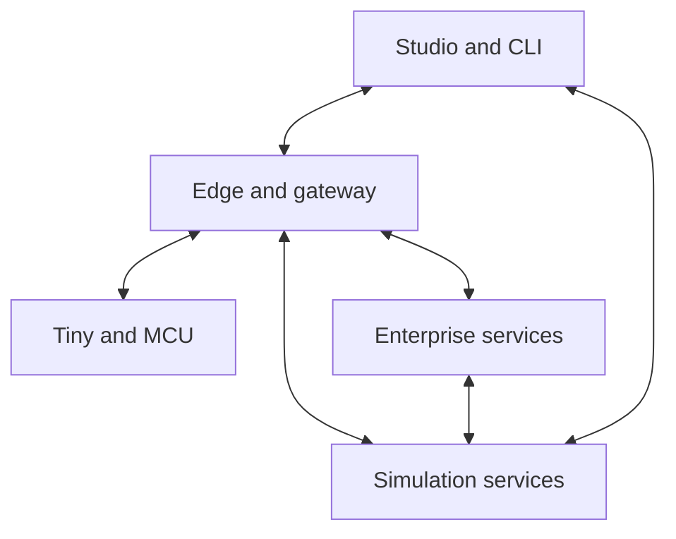

# Neuradix Robotics Platform — Review and Strategy v1.0
This is the repository-native text of the revised review dated 8 September 2026. It preserves the static findings and research citations. The [Functional Specification v0.6](Neuradix_Robotics_Platform_Functional_Specification_v0.6.md) and [Implementation Plan v0.4](Neuradix_Implementation_Plan_v0.4.md) turn its recommendations into proposed requirements and work. [Capability Status](Neuradix_Capability_Status.md) records current implementation; this review does not claim the planned system already exists.

## One platform, from Arduino to enterprise
**Revised deep research and code review | 8 September 2026**

Prepared for Kevin Busuttil, Busuttil Technologies Limited.

### Revised recommendation
Build Neuradix as a **unified robotics development and operations platform**: one coherent environment for modelling, programming, controlling, simulating, testing, deploying and operating robotic systems. Support classical control, automation, autonomy and AI within the same platform.

The product promise should be: **Define your robotic system once; build, simulate, deploy and observe it across compatible hardware, from a tiny Arduino to enterprise infrastructure.** A shared project, component model and toolchain should connect these activities. AI is an optional capability throughout that lifecycle.

This supersedes the earlier AI-workbench positioning and its delivery estimate. The broader scope aligns with your specification's runtime, simulation, safety, embedded and operational ambitions. Your Embedded implementation plan already distinguishes generated AVR C/C++ from native no_std Rust and richer MCU tiers. [Functional Specification v0.5](https://github.com/KevinBusuttil/neuradix-robotics-platform/blob/e39da5e31709259b3fd876a9ed2fd350263c2bb3/docs/Neuradix_Robotics_Platform_Functional_Specification_v0.5.md) [Embedded implementation plan](https://github.com/KevinBusuttil/neuradix-robotics-platform/blob/e39da5e31709259b3fd876a9ed2fd350263c2bb3/docs/Neuradix_Embedded_Profile_Implementation_Plan_v0.1.md)

### What makes the vision technically credible
- **One platform with several execution profiles.** Keep contracts, identities, time semantics and engineering workflows consistent; compile only the supported capabilities into each target.
- **Integrated simulation as a core product.** Give real and simulated components the same interfaces, project model, inspection and test workflow, with declared fidelity and timing limits.
- **Local autonomy with distributed capacity.** Place control and fallback near the machine; distribute suitable simulation, analysis, planning and data workloads across servers.
- **A native platform with an adoption bridge.** Own the core semantics and user experience while supporting ROS 2, Gazebo and established libraries through qualified adapters.

### What the review establishes
The repository contains a useful foundation prototype, including a newer development branch with embedded and simulation work. It does not yet demonstrate an integrated simulator, physical Arduino deployment or enterprise scalability. Static review also found correctness issues, including an additional AVR-specific C++ memory-layout defect described in section 4. [development README](https://github.com/KevinBusuttil/neuradix-robotics-platform/blob/c8aa4671bcee8739354beb7880551db7f64314fa/README.md)

Broad adoption is an objective to validate with engineers. The first release should prove the complete Arduino-to-server workflow on one small robotic system, while preserving the broader product architecture.

# 1. What the repository actually contains
The review covers the authoritative Functional Specification v0.5, Implementation Plan v0.3, relevant RFCs, implementation boundaries and tests. Both available branch heads were inspected; their distinction materially changes the assessment. [main README](https://github.com/KevinBusuttil/neuradix-robotics-platform/blob/e39da5e31709259b3fd876a9ed2fd350263c2bb3/README.md) [development README](https://github.com/KevinBusuttil/neuradix-robotics-platform/blob/c8aa4671bcee8739354beb7880551db7f64314fa/README.md) [branch comparison](https://github.com/KevinBusuttil/neuradix-robotics-platform/compare/e39da5e31709259b3fd876a9ed2fd350263c2bb3...c8aa4671bcee8739354beb7880551db7f64314fa)

| Baseline | Verified state |
|---|---|
| Default branch | main at e39da5e, 18 July 2026; 10 library/tool crates plus two executable examples; workspace version 0.0.1. |
| Newest development head | claude/gifted-albattani-i7t2wc at c8aa467, 20 July 2026; six commits ahead, none behind; adds five crates and two examples. |
| CI evidence | GitHub reports successful Rust workflows for both exact heads. These are historical results, not a fresh local execution. |
| Distribution | Repository is private, with Apache-2.0 licensing in the workspace; the GitHub releases endpoint returned no releases. |

| Capability | main | Additional development-branch capability |
|---|---|---|
| Contracts, time, local transport | Scalar stream contracts, hashing, Rust generation, tagged clocks, bounded in-process queue | Time becomes no_std-compatible; embedded code generation added |
| Runtime, safety, Python | Lifecycle, lockstep processor, scalar safety gate, lineage, FDIR, supervised Python process | Same core, plus separate embedded gate/watchdog primitives |
| Recording | Native container and record digest | Handwritten uncompressed MCAP backend and export |
| Simulation | Canned depth-stream/controller demonstration | Closed-loop, one-dimensional depth plant and sensor |
| Studio | CLI inspection/explanation | Headless timeline, window, nearest-record and scalar-series library; no graphical UI |
| Embedded | Planned | no_std core, serial framing, Rust/C++ projections and host conformance tests; no flashed board |

Still absent at the development head: ROS 2/MAVLink bridges, network and shared-memory backends, a deployed graph supervisor, live recording against a running graph, graphical Studio, physical board integration and model-training/inference integrations. The README explicitly marks most of these omissions. [development README](https://github.com/KevinBusuttil/neuradix-robotics-platform/blob/c8aa4671bcee8739354beb7880551db7f64314fa/README.md)

**Assessment:** a coherent foundation prototype. Its tests do not establish production timing, hardware safety, multimodal throughput or general compatibility. Rust was unavailable locally, so no build, test suite or hardware experiment was rerun. [main CI run](https://github.com/KevinBusuttil/neuradix-robotics-platform/actions/runs/29661906798) [development CI run](https://github.com/KevinBusuttil/neuradix-robotics-platform/actions/runs/29723577698)

# 2. Correctness issues to address first
These are findings from static source inspection. The triggering conditions below should become focused regression tests; this review did not execute Rust reproductions. Their priority reflects the platform's stated dependability goals.

### High priority: schema identity can disagree with wire layout
The schema canonicalizer sorts payload fields by name, deliberately making identity independent of declaration order. The embedded generator calculates offsets by iterating the original field sequence. Reordering two equal-width fields therefore preserves the schema hash while reversing their wire positions. [schema identity code](https://github.com/KevinBusuttil/neuradix-robotics-platform/blob/e39da5e31709259b3fd876a9ed2fd350263c2bb3/crates/contracts/src/canonical.rs) [embedded wire generator](https://github.com/KevinBusuttil/neuradix-robotics-platform/blob/c8aa4671bcee8739354beb7880551db7f64314fa/crates/embedded-codegen/src/rust_gen.rs)

For example, a payload with depth=2 and uncertainty=0.1 can be decoded with those values exchanged by a receiver generated from a reordered contract, while both claim the same schema identity. Fix this by canonicalizing wire order, or explicitly including ordered field layout, codec and codec version in a distinct wire identity. Test cross-decoding between separately generated reordered contracts, rather than only round trips within one projection.

### High priority: the host safety boundary is incomplete
SafetyGate authorizes against request.at; its Processor implementation ignores the executor's TickContext. There is no independent check of command age against trusted receive/evaluation time. A stale request carrying an earlier valid timestamp is therefore not rejected simply because the real lease has now expired. Evaluate authority using a trusted clock and separately validate the source timestamp, age, sequence and deadline. [host safety gate](https://github.com/KevinBusuttil/neuradix-robotics-platform/blob/e39da5e31709259b3fd876a9ed2fd350263c2bb3/crates/safety/src/gate.rs)

The same host gate accepts an unvalidated safe_value. Range validation checks min > max but does not reject NaN bounds. With no lease envelope, non-finite commands are not explicitly rejected before constraints. NaN bounds can also reach floating-point clamp operations. Validate finite inputs, finite configuration and the final output, and make invariant-bearing fields private. [constraint validation](https://github.com/KevinBusuttil/neuradix-robotics-platform/blob/e39da5e31709259b3fd876a9ed2fd350263c2bb3/crates/safety/src/constraint.rs) [host safety gate](https://github.com/KevinBusuttil/neuradix-robotics-platform/blob/e39da5e31709259b3fd876a9ed2fd350263c2bb3/crates/safety/src/gate.rs)

### High priority: Python timeouts do not bound the whole request
The worker uses an unbounded reader channel and unbounded read_line. A request writes to stdin before its response deadline begins; a blocked pipe can therefore exceed the configured request timeout. On a closed output stream, exit_error waits for process exit, which can block if the process remains alive. [Python worker implementation](https://github.com/KevinBusuttil/neuradix-robotics-platform/blob/e39da5e31709259b3fd876a9ed2fd350263c2bb3/crates/python/src/worker.rs)

Use bounded message lengths and queues, cancellable or nonblocking I/O, deadlines covering write and read, heartbeat-based health, process-tree cleanup and resource limits. Process separation provides crash containment; it does not by itself provide memory/CPU isolation or a security sandbox.

# 3. Integration gaps and product claims
### MCAP support is currently a private subset
The development backend writes message encoding neuradix and schema encoding neuradix/schema-id, storing a hash rather than a complete standard message schema. Its reader requires Neuradix clock-domain metadata, does not decode Chunk records, and ignores message encoding. Ordinary third-party files can therefore fail or yield incomplete data. It also loads/buffers recordings in memory. [MCAP implementation](https://github.com/KevinBusuttil/neuradix-robotics-platform/blob/c8aa4671bcee8739354beb7880551db7f64314fa/crates/record/src/mcap.rs)

MCAP permits arbitrary payloads, so a valid container alone does not imply usable ROS/Foxglove messages. Foxglove documents specific encodings, including JSON/JSON Schema and ROS 2 CDR with ROS schemas. Adopt the maintained MCAP library behind your Recording interface, preserve complete schemas and source/receive times, and verify interoperability using independent writers and readers. [MCAP specification](https://mcap.dev/spec) [Foxglove encodings](https://docs.foxglove.dev/docs/getting-started/custom/custom-schema-encodings)

### The replay CLI currently checks records, not a changed program
replay run loads a recording and compares its record digest. It does not launch a processor or deployment graph. Separately, the runtime's lockstep test really does decode recorded inputs, instantiate a fresh processor and compare its outputs. Preserve that distinction in documentation and expose the latter through a versioned evaluation runner. [replay CLI implementation](https://github.com/KevinBusuttil/neuradix-robotics-platform/blob/c8aa4671bcee8739354beb7880551db7f64314fa/crates/cli/src/app/record.rs) [lockstep replay test](https://github.com/KevinBusuttil/neuradix-robotics-platform/blob/e39da5e31709259b3fd876a9ed2fd350263c2bb3/crates/runtime/tests/lockstep_replay.rs)

### Deployment identity does not fully pin resolved behaviour
Graph validation returns resolved schema identities, but deployment_identity hashes the declarative graph without incorporating those resolutions. Replacing a schema behind an unchanged reference can leave the deployment identity unchanged. Introduce a compiled deployment lock manifest covering schema/codec hashes, configuration, QoS, artifacts and policy revisions. [deployment identity](https://github.com/KevinBusuttil/neuradix-robotics-platform/blob/e39da5e31709259b3fd876a9ed2fd350263c2bb3/crates/graph/src/identity.rs)

### Declarative topology is not enforcement
Graph validation rejects every cycle and checks actuator adjacency by declared roles. It cannot prove that an arbitrary component labelled Safety implements the gate, or prevent an external driver bypass. The blanket cycle rule also needs explicit delayed-feedback semantics for closed-loop graphs. Use graph validation as one layer, with runtime capability enforcement and hardware/controller boundaries separately implemented. [graph validation](https://github.com/KevinBusuttil/neuradix-robotics-platform/blob/e39da5e31709259b3fd876a9ed2fd350263c2bb3/crates/graph/src/validate.rs)

**Release implication:** retain the current foundations, but describe their tested scope precisely. MCAP exchange, runtime re-execution and physical command enforcement each need their own acceptance test. Passing an internal round trip is insufficient evidence for these broader promises.

# 4. Arduino-to-enterprise execution profiles
**Seamless means continuity of the engineering model and compatible component behaviour.** Processing capacity, operating systems, transports and deployable features remain explicit. The following profiles are proposed product contracts, not current support claims.

| Profile | Execution model | Intended responsibility |
|---|---|---|
| Tiny: Uno R3 / AVR | Generated C/C++; static loop, fixed buffers, compact messages | Sensors, simple control, actuator limits, watchdog and communication-loss response |
| MCU: 32-bit devices | no_std Rust or generated C/C++; qualified bare-metal / RTOS executors | Multi-rate control, device drivers, bounded local graphs; serial, CAN or supported networking |
| Edge: Linux robot computer | Rust runtime; isolated C++ / Python components; optional GPU | Robot supervision, perception, planning, device gateways, recording and local missions |
| Workstation | Same host runtime plus Studio and simulation services | Modelling, visual development, interactive simulation, debugging, replay and hardware testing |
| Enterprise | Server processes and optional cluster deployment | Many robots, parallel simulation, analysis, shared data, collaboration and managed deployment |

An Uno R3 has 32 kB flash and 2 kB SRAM on its principal ATmega328P. Reserve memory for application state, stack, interrupts, drivers and communication buffers. Keep rich schema descriptions and package resolution on the host; derive compact, versioned endpoint identifiers for the board. Report actual firmware and RAM usage. [Arduino Uno specifications](https://docs.arduino.cc/resources/datasheets/A000066-datasheet.pdf)

### Additional high-priority finding: C++ is not yet AVR-safe
The generator maps Float64 to C++ double and emits eight-byte memcpy operations. The checked-in depth header does this for both depth and uncertainty. Standard Uno double is four bytes. Encoding can read beyond a field; decoding can overwrite adjacent fields or the object boundary. Host C++ conformance cannot establish AVR correctness. [C++ projection generator](https://github.com/KevinBusuttil/neuradix-robotics-platform/blob/c8aa4671bcee8739354beb7880551db7f64314fa/crates/embedded-codegen/src/cpp_gen.rs) [generated depth header](https://github.com/KevinBusuttil/neuradix-robotics-platform/blob/c8aa4671bcee8739354beb7880551db7f64314fa/crates/embedded-codegen/tests/golden/vehicle_depth.h) [Arduino double reference](https://github.com/arduino/reference-en/blob/master/Language/Variables/Data%20Types/double.adoc)

Make code generation target-aware. Add compile-time representation checks; reject unsupported binary64 contracts, or implement a deliberate codec/conversion with explicit precision semantics. Never silently reinterpret binary64 as binary32. Cross-compile for the actual Arduino toolchain and verify wire vectors on a real board. This finding is based on source and documented ABI behaviour; no AVR reproduction was executed.

The existing Embedded plan provides the right foundation. Bring actual Uno and one 32-bit MCU into the first integrated milestone, with board-specific build, flash, monitor and conformance support. [Embedded implementation plan](https://github.com/KevinBusuttil/neuradix-robotics-platform/blob/e39da5e31709259b3fd876a9ed2fd350263c2bb3/docs/Neuradix_Embedded_Profile_Implementation_Plan_v0.1.md)

# 5. The consolidated platform
Consolidation should remove repeated integration work. A project should have one versioned system model from which Neuradix derives component interfaces, target deployments, simulation bindings, diagnostics and test manifests. This is the central architectural recommendation.

| Platform capability | Unified engineering experience |
|---|---|
| System and robot model | Mechanical structure, coordinate frames, units, sensors, actuators, calibration, components and target placement belong to one linked project. |
| Component programming | Rust, C/C++ and Python SDKs share typed ports, configuration, lifecycle, health and error semantics; supported languages vary by target. |
| Control and autonomy | PID and state-space control, state estimation, state machines, behaviour trees, planning and mission execution use the same component boundaries. |
| Communication | Streams, state, events, commands, queries and cancellable tasks have explicit delivery, freshness and authority rules. |
| Simulation and testing | World editing, virtual devices, physical models, scenario execution, fault injection and hardware-in-the-loop share project identities. |
| Studio and CLI | One interface for modelling, wiring, building, flashing, launching, live inspection, replay and diagnosis; automation uses the same service API. |
| Packages and operations | Versioned components, device support, models, firmware, deployment bundles, recorded runs, fleet state and permissions remain traceable. |

### The project compiler is the organising mechanism
Resolve a human-editable project into an immutable deployment manifest. Include semantic schemas and wire layouts, artifact digests, configuration, target capabilities, scheduling, queue sizes, clock mappings, calibration, simulator assets and policy versions. Generate appropriate firmware and host/server launch artifacts from that resolved model.

Validate units and frames, bounded message sizes, unsupported types, bandwidth budgets and placement constraints before deployment. Timing analysis needs measured execution bounds and a qualified executor; the compiler must report unknowns rather than inventing a schedulability guarantee. Explain errors in engineering terms, such as an oversized MCU buffer or a control deadline that a network path cannot satisfy.

### Preserve real portability
Portable logic can move when another target supports its language, numeric requirements, timing and device interfaces. Hardware drivers and resource-heavy algorithms need appropriate implementations. Keep stable component interfaces so changing a board or simulator does not force manual schema rewrites. Pin behaviour-changing conversions in the manifest.

Current contracts and graph identity are a starting point, but scalar generation and declarative graph hashes do not yet implement this full system model. [current contract generator](https://github.com/KevinBusuttil/neuradix-robotics-platform/blob/e39da5e31709259b3fd876a9ed2fd350263c2bb3/crates/contracts/src/generate.rs) [deployment identity](https://github.com/KevinBusuttil/neuradix-robotics-platform/blob/e39da5e31709259b3fd876a9ed2fd350263c2bb3/crates/graph/src/identity.rs)

# 6. Runtime architecture and communication
Use a small semantic core with separate executors and transport backends. Reuse validated rules for identity, time, validity, lifecycle and command authority across profiles. Tiny targets receive generated subsets; richer targets can load more services and components.

The diagram shows proposed runtime relationships. A shared project compiler configures every deployment. Studio inspects the running system; losing Studio or enterprise connectivity must not break local control and fallback.

### Match the communication path to its job
Use bounded in-process channels for local components, suitable shared-memory buffers for large co-located payloads, and a qualified routed transport for networked systems. Use compact serial/CAN framing for constrained devices. A gateway translates transport and discovery while preserving identity, timestamp provenance, sequence and command expiry.

Zenoh is a reasonable network candidate to benchmark. Its use alone does not implement ROS 2 compatibility: rmw_zenoh specifies additional ROS conventions and explicitly lacks interoperability with zenoh-plugin-ros2dds. Qualify a ROS client-library adapter separately. [rmw_zenoh interoperability](https://github.com/ros2/rmw_zenoh)

### Keep timing and authority explicit
Support static cyclic or qualified interrupt/task scheduling on embedded targets, bounded control execution on capable hosts, and throughput-oriented scheduling for batch work. Define delayed feedback edges for control loops. Represent hardware, monotonic, simulation and wall clocks explicitly, including timer rollover, reboot epochs and synchronization uncertainty.

CRC detects transmission errors; it does not authenticate commands. Enforce device-local expiry and limits, and terminate richer network identity and authorization at capable endpoints or gateways. Give every command an idempotency/sequence policy so reconnection cannot silently repeat an action. Validate end-to-end enforcement with fault injection.

Real-time guarantees require the complete hardware, OS, executor, drivers and application path to satisfy deadlines. Rust and bounded queues help, but neither alone proves those guarantees. ROS 2's real-time guidance makes the same system-level distinction. [ROS 2 real-time guidance](https://design.ros2.org/articles/realtime_background.html)

# 7. Integrated simulation
Neuradix Sim should share the robot model, component contracts, clocks, configuration and deployment identities used on hardware. Studio should offer scene editing, component inspection, control tuning, recording and test results in one workspace. Engineers should switch a device binding between simulated, emulated and physical implementations through a qualified configuration.

| Simulation layer | Purpose and required evidence |
|---|---|
| Fast component / control models | Small CPU tests for algorithms, state machines, timing and failure responses; retain the existing AUV depth fixture here. |
| Interactive robotic simulation | Articulated rigid bodies, collisions, joints, actuators, terrain and common sensors; inspect contacts, frames, timing and controller state. |
| Domain and sensor extensions | Marine buoyancy/drag, aerial dynamics, specialised sensors and environments, added as separately validated packages. |
| High-fidelity / accelerated backends | Optional richer rendering and GPU simulation for suitable workloads; record hardware requirements and backend limitations. |
| Hardware-in-the-loop | Real firmware and I/O linked to simulated plant behaviour; measure transport delay, scheduling and clock alignment. |
| Batch validation | Run scenarios and parameter sweeps locally or across workers with reproducible manifests, metrics and retained failures. |

### Own the experience; reuse proven numerical machinery
Make the scene and simulation API, time orchestration, device bindings, scenario system and results native to Neuradix. Use headless Gazebo as the first backend behind this native API; qualify direct physics-library backends as the platform develops. Gazebo already separates its simulator, physics, rendering, sensors and plugins; its modular architecture supports reuse without requiring a new physics solver first. [Gazebo architecture](https://gazebosim.org/docs/latest/architecture/)

Support URDF/SDF import through validated mappings. Preserve unsupported properties and issue explicit fidelity reports. Add richer scene exchange where required; do not promise lossless conversion among different physics and material models. Keep simulation assets, random seeds, solver settings and calibration versioned with each run.

### Reproducibility has several levels
Separate recording integrity, program re-execution, closed-loop numerical agreement and physical task outcomes. Logged inputs do not reveal how changed actions would alter future observations. Use closed-loop simulation and hardware trials for that question; state tolerances and repeat counts for stochastic or numerically variable runs.

Isaac Lab documents conditions on reproducibility, including hardware/software and scene type. Treat bitwise determinism as a scoped claim. The current Neuradix one-dimensional AUV plant is useful for foundation testing but does not establish Gazebo-class simulation capability. [Isaac Lab determinism](https://isaac-sim.github.io/IsaacLab/main/source/features/reproducibility.html) [AUV plant model](https://github.com/KevinBusuttil/neuradix-robotics-platform/blob/c8aa4671bcee8739354beb7880551db7f64314fa/crates/sim/src/plant.rs)

# 8. Enterprise scale and local operation
Enterprise support belongs in the architecture from the start. A single installation should grow from a local process to multiple workers, then to a managed cluster using the same run and deployment manifests. Server scale introduces additional operational responsibilities beyond larger message throughput.

| Scaling dimension | Proposed mechanism | Validation required |
|---|---|---|
| More computation | Parallel scenario/evaluation jobs; resource-aware CPU/GPU placement | Throughput, queue time, recovery, result correctness and cost per run |
| More robots | Site gateways, explicit discovery scopes and partitioned telemetry | Reconnect storms, link loss, command freshness and site isolation |
| More data | Chunked recordings, object storage, indexed metadata and retention policies | Ingestion and query performance, storage growth and backpressure |
| More teams | Tenant/project identity, roles, quotas, audit and shared registries | Access isolation, reproducible environments and operational ownership |
| Higher availability | Recoverable workers, redundant services and durable desired state | Failover, restore, duplicate-task handling and staged rollback |

Start with local and multi-process workers, then offer a Kubernetes backend where it solves the deployment problem. Kubernetes Jobs provide retryable run-to-completion and parallel execution; GPU placement requires the appropriate drivers and device plugins. Neuradix still owns robot-specific semantics, artifacts and acceptance criteria. [Kubernetes Jobs](https://kubernetes.io/docs/concepts/workloads/controllers/job/) [Kubernetes GPU scheduling](https://kubernetes.io/docs/tasks/manage-gpus/scheduling-gpus/)

### Preserve locality and resilience
Keep fast control, device limits and essential mission/fallback behaviour on the robot or site. Allow the enterprise plane to distribute approved missions, software and configuration, and collect evidence. Bound local storage and reconcile telemetry after reconnection. Explicitly reject expired commands; reserve retries for operations with defined duplicate-handling semantics.

Separate live robot communication from bulk upload and cluster job traffic. Prefer moving computation toward large sensor datasets; a camera pipeline must not accidentally be routed through a tiny serial endpoint. Advertise runtime capabilities and reject invalid placement before launching a workload.

### Be precise about the scaling promise
Many independent simulation worlds can be distributed across workers. A single tightly coupled world needs a deliberate partitioning and synchronization design; additional servers do not guarantee a linear speedup. Similarly, a CPU server and a GPU simulation server are different deployment classes.

For example, the reviewed Isaac Sim requirements demand RTX-capable graphics and exclude A100/H100 for that simulator because they lack RT cores. Maintain workload-specific capability checks instead of a generic GPU flag. [Isaac Sim requirements](https://docs.isaacsim.omniverse.nvidia.com/latest/installation/requirements.html)

No cluster benchmark, fleet scale test or high-availability experiment was performed in this review. Publish supported scale only after testing named workloads, hardware and failure conditions.

# 9. How to improve on the existing ecosystem
The opportunity is to deliver a more coherent engineering system and prove lower integration effort. ROS 2 already addresses communication QoS and lifecycle management; micro-ROS has Arduino integrations for supported boards, including bare-metal use. Embedded participation and modularity alone are therefore insufficient differentiation. [ROS 2 QoS design](https://design.ros2.org/articles/qos.html) [ROS 2 lifecycle design](https://design.ros2.org/articles/node_lifecycle.html) [micro-ROS Arduino support](https://github.com/micro-ROS/micro_ros_arduino)

| Existing foundation | Neuradix strategy |
|---|---|
| ROS 2 and its packages | Offer a native component/runtime path plus a maintained bridge. Preserve topics, services, actions, cancellation, QoS and clock semantics through explicit mappings. |
| Gazebo and simulator libraries | Deliver integrated Neuradix Sim and Studio workflows, with backend reuse and import/export. Measure setup effort, debugging quality and scenario reproducibility. |
| micro-ROS / Arduino ecosystem | Offer generated Tiny support and unified board tooling. Publish a board and compiler matrix; compare actual footprint and workflow on overlapping targets. |
| dora | Benchmark dataflow, supervision and replay against a current alternative. Differentiate with cross-target compilation, integrated simulation and physical deployment evidence. |
| MCAP, Rerun and Foxglove | Use open recording interchange and optional visualisation integrations. Build the unified project and diagnostic experience without making a viewer a mandatory runtime dependency. |
| Kubernetes and server tooling | Reuse general cluster scheduling and storage; add robotics-aware run, fleet, artifact and offline-operation semantics. |

dora 1.0 was released on 2 September 2026 and includes Rust/Python/C++ dataflow capabilities. Rerun spans multimodal visualization and data workflows. Benchmark concrete tasks against them; avoid presenting existing features as unique inventions. [dora 1.0 release](https://github.com/dora-rs/dora/blob/main/docs/blog/2026-09-02-dora-1.0.md) [Rerun](https://github.com/rerun-io/rerun)

### Compatibility is a maintained product commitment
As of this review, ROS 2 Lyrical is the current LTS, released in May 2026. Gazebo recommends Lyrical/Jetty and Jazzy/Harmonic pairings. Choose the first supported pairing based on qualified driver and package availability, then add the second. Jazzy remains a reasonable compatibility baseline where needed. [ROS 2 Lyrical release](https://discourse.openrobotics.org/t/ros-2-lyrical-luth-released/55021) [ROS/Gazebo pairings](https://gazebosim.org/docs/latest/ros_installation/)

Maintain release-pinned adapters and golden interchange fixtures. Use the maintained MCAP implementations rather than expanding a private subset indefinitely. Make buildable source, extension APIs, package manifests and offline use central to the adoption strategy. [MCAP libraries](https://github.com/foxglove/mcap)

**Recommended positioning:** an integrated, extensible robotics platform with a consistent engineering model from device firmware to simulation and enterprise operations. Claims of better usability, performance and dependability should refer to published comparisons on representative workflows.

# 10. Engineering value and optional AI
The baseline experience must be useful for classical robotics, embedded automation and control engineering. An engineer should be able to build and tune a sensor/controller/actuator system, simulate failures, flash firmware and inspect a deployed system without configuring a model provider.

| Engineering discipline / task | Platform workflow |
|---|---|
| Embedded and electronics | Configure I/O, generate contracts, build/flash firmware, inspect timing, resource use and resets. |
| Control and mechatronics | Model dynamics, tune controllers, inspect units/frames, run parameter sweeps and compare simulation with hardware. |
| Robotics and autonomy | Compose estimation, navigation, manipulation and mission components; test recovery and deploy the same interfaces. |
| Test and systems engineering | Version scenarios, inject faults, reproduce regressions and trace software/configuration to observed behaviour. |
| Operations and enterprise | Manage approved deployments, site health, fleet records, access, rollback and incident analysis. |
| AI and data engineering | Record observations/actions, derive datasets, evaluate models, run shadow inference and deploy qualified components. |

### AI belongs in the component and evidence model
Support AI in two places: development assistance in Studio, and learned components in the robot or simulation. An assistant can explain failures, draft graphs or code, search documentation and propose tests. Route its edits through the same compiler, validation and review paths as human changes.

For deployed learning, define observation/action schemas, model and preprocessing identities, frame and unit assumptions, inference deadlines, health and fallback. Record those alongside conventional controller versions. Keep model runtimes isolated from the trusted command boundary; expose proposals through ordinary typed component interfaces.

LeRobot is a useful optional integration for demonstration capture, training and policy deployment. Its workflow has upload defaults that must be explicitly configured for local-only projects. More advanced adapters can target openpi and GR00T when a supported workload needs them; dataset, checkpoint and license requirements remain adapter-specific. [LeRobot workflow](https://huggingface.co/docs/lerobot/en/il_robots) [openpi](https://github.com/Physical-Intelligence/openpi) [GR00T reference implementation](https://github.com/NVIDIA/Isaac-GR00T)

### Keep the core stable as AI changes
Model providers, architectures and dataset formats will evolve faster than device and control contracts. Place them behind versioned adapters with explicit access and dependency manifests. Require held-out evaluation, closed-loop trials where appropriate and failure-response checks before promoting a learned component to hardware.

Native classical-control examples should ship alongside optional learning examples. This keeps Neuradix useful across robotics disciplines and lets teams adopt new AI capabilities within an already familiar engineering workflow.

# 11. A sequence of complete systems
Retain the implementation plan's vertical-slice principle, but choose a slice that spans the required scale range. Arduino, simulation and server execution should appear in the first integrated proof. The following gates describe proposed acceptance scope; they are not measured completion dates. [Implementation Plan v0.3](https://github.com/KevinBusuttil/neuradix-robotics-platform/blob/e39da5e31709259b3fd876a9ed2fd350263c2bb3/docs/Neuradix_Implementation_Plan_v0.3.md)

| Gate | Delivery scope | Evidence to proceed |
|---|---|---|
| A. Trustworthy baseline | Review the six development commits; fix schema/wire order, AVR types, host gate, Python bounds and recording interchange | Focused regressions, explicit compiler-dependent CI checks and one truthful capability matrix |
| B. Cross-target foundation | Project compiler, locked identities, one Uno and one 32-bit MCU, one edge host, serial gateway and local control | Actual build/flash, compatible wire vectors, measured resources and communication-loss fallback |
| C. Integrated platform alpha | Minimal graphical Studio, a useful physics backend, virtual/physical device bindings, replay and hardware-in-the-loop | The same small robotic system is configured, simulated, deployed and diagnosed through one project |
| D. Distributed alpha | Local worker and two-server worker mode, batch runs, durable artifacts and reconnect handling | Independent runs distribute correctly; worker loss recovers; robot control continues during server loss |
| E. Supported first release | Installer, stable SDKs, package/board matrix, ROS bridge, documentation and selected real deployments | External teams reproduce the complete workflow; specified timing, data and failure tests pass |
| F. Broader platform | Additional boards, physics/domain packages, collaborative operations, fleet scale and optional AI integrations | Demand, maintainership and quantitative evidence for each added support claim |

### The first integrated demonstrator
Use a small, instrumented motor/sensor rig or mobile robot with an Uno endpoint, a 32-bit MCU variant, an edge computer and a simulated counterpart. Run the same scenario suite on a workstation and server workers. Retain the AUV depth fixture as a fast internal regression alongside this demonstrator.

Integrate a classical controller first. This exercises contracts, clocks, device I/O, authority, simulation, deployment and diagnostics without making model quality a dependency. Add a learned component later to prove extensibility through the same interfaces.

### Resourcing and calendar expectations
The earlier 4-6 month estimate covered a much narrower AI workbench and does not apply to this platform. A defensible schedule needs team capacity, available boards, a selected physics backend and estimates for each acceptance gate. Budget for sustained runtime/embedded, simulation/graphics, developer-tooling and distributed-systems work, plus hardware verification and documentation.

For the next 90 days, use Gates A-B and the first simulation/Studio integration as planning priorities, adjusted to actual staffing. Do not label that horizon as full ROS 2/Gazebo ecosystem parity. Publish dates after the first target and simulator integration spikes expose the real work.

# 12. Make seamless scalability testable
Define success using the complete engineer journey. These are proposed acceptance criteria for the first integrated system; none is a reported benchmark result.

| Test | Observable pass condition |
|---|---|
| Create and simulate | A supported installation opens one project and runs its simulated closed-loop system without hand-written adapter glue. |
| Deploy to actual boards | One project produces target-specific Uno and 32-bit MCU firmware; flashing and health inspection use documented tooling. |
| Preserve data meaning | Independent firmware and host endpoints agree on types, wire layout, units, frames, identifiers and timestamp interpretation. |
| Handle invalid placement | The compiler rejects unsupported types, oversized buffers and unqualified timing paths with a useful explanation. |
| Replace a virtual device | A real board replaces its simulated binding; relevant control logic and interfaces are retained, with timing differences visible. |
| Diagnose a failure | An engineer follows sensor input, controller state, command rejection and applied output, then reruns the captured regression. |
| Scale execution | The same scenario manifest runs locally and across two workers; failures, retries and results retain traceable identities. |
| Survive disconnection | Server, UI and gateway loss trigger the specified local continuation or safe state; reconnection does not replay stale commands. |
| Reproduce elsewhere | A second engineer resolves the pinned packages/assets and repeats the run without undocumented local dependencies. |

### Publish measurements with their operating conditions
On Tiny/MCU: report flash, static RAM, observed stack margin, execution-time distribution, worst observed latency, queue capacity, message rate and watchdog response. Distinguish observed timing from an analytical worst-case bound.

On Edge: measure sensor-to-command latency, deadline misses, CPU/GPU load, memory, recording throughput and behaviour under overload. On servers: measure completed runs per unit time, scaling efficiency, queue delay, storage/query cost and worker recovery. Record hardware, OS, toolchain, workload and settings for every result.

### Adoption should be demonstrated across disciplines
Recruit design partners in embedded/control, robotics integration and test/operations. Ask each to complete a real task using their current tools and Neuradix. Compare setup time, duplicated configuration, time to diagnose a failure and repeat use. A low-end electronics user and an enterprise engineer should recognise the same project and diagnostic concepts.

Keep the core SDKs, project format, local tools and representative examples accessible. Candidate commercial services include supported distributions, qualified device packs, team collaboration, fleet operations and managed compute. Adoption, willingness to pay and broad market share remain unverified.

# 13. Specification changes and review limits
### Changes recommended for the documentation
1. **State the complete product promise.** Position Neuradix around robotics modelling, development, control, simulation, testing, deployment and operations across hardware scales. Keep AI as an optional platform capability.
2. **Formalise the execution profiles.** Specify language/ABI, numeric types, memory, clocks, lifecycle, scheduling, transport, security responsibility and tooling for Tiny, MCU, Edge, Workstation and Enterprise.
3. **Define one resolved system model.** Connect mechanical description, contracts, device capabilities, deployment placement, simulator bindings, configuration and artifact identity through the project compiler.
4. **Promote simulation and board tooling into the first integrated release.** Specify the native Sim/Studio experience, backend boundaries, fidelity reports, build/flash workflows and actual hardware acceptance tests.
5. **Define distributed operations early.** Cover worker execution, site autonomy, discovery scopes, resource placement, identities, data retention, disconnection and retry semantics.
6. **Maintain a supported-capability matrix.** Distinguish planned, implemented, independently interoperable, hardware-demonstrated and supported. Link claims to versioned tests and examples.
7. **Repair status and document drift.** Reconcile the development branch through normal review; update stale module comments and subsection numbering. Use separately gated releases for domain packs and advanced profiles.

The existing specification and Embedded plan provide substantial direction to retain. This revision changes the recommended product emphasis and acceptance sequence; it does not replace the underlying ambitions with an AI-specific product. [Functional Specification v0.5](https://github.com/KevinBusuttil/neuradix-robotics-platform/blob/e39da5e31709259b3fd876a9ed2fd350263c2bb3/docs/Neuradix_Robotics_Platform_Functional_Specification_v0.5.md) [Embedded implementation plan](https://github.com/KevinBusuttil/neuradix-robotics-platform/blob/e39da5e31709259b3fd876a9ed2fd350263c2bb3/docs/Neuradix_Embedded_Profile_Implementation_Plan_v0.1.md)

### Review scope
This was a read-only research and static code review of the available main and development heads, specification, plans, RFCs and relevant implementation/test paths. Historical GitHub CI success was checked at both exact heads. Current primary sources were checked for Arduino constraints, ROS/Gazebo, robotics tooling, simulation and server execution.

No repository code was changed. No Rust build, AVR compilation, physical experiment, network benchmark, cluster test, penetration test or certification assessment was performed. Static findings describe source-level triggering conditions and require focused reproductions before fixes are signed off.

The architecture, product positioning, gates and acceptance targets are recommendations inferred from the reviewed implementation and stated requirements. They are not current platform capabilities. Team capacity, real-world performance, long-term maintainership, field reliability and commercial adoption remain unknown.

Research stopped after targeted source checks resolved the consequential architecture choices. Remaining questions require prototype integration, actual board/cluster measurements and engineer feedback. Some current ROS documentation pages were inaccessible; accessible official design documents and release sources support the bounded claims used here.

**Recommended next engineering deliverable:** a reviewed cross-target architecture specification and backlog for Gates A-C, centred on one project that genuinely builds, simulates and operates a physical robotic system.
