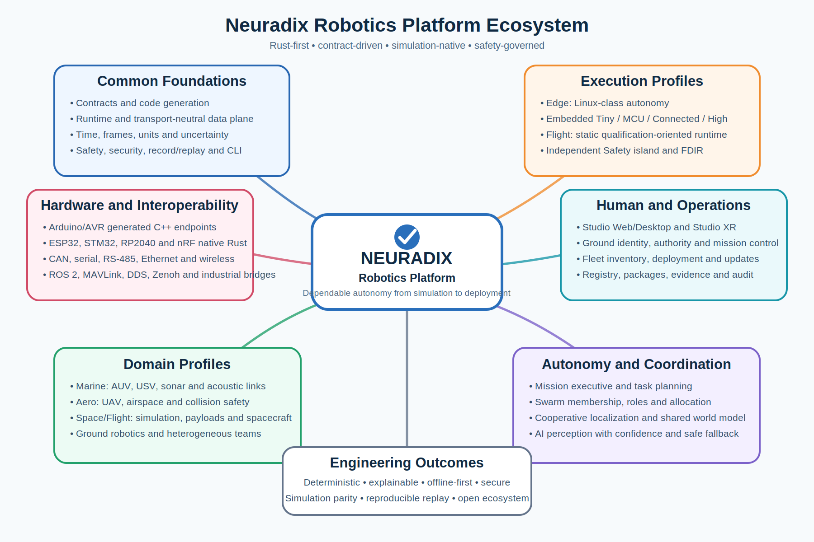

# 0. Purpose

This plan updates Neuradix Studio to cover the full current ecosystem, including embedded nodes and the CLI.



Studio remains:

- local-first;
- contract-native;
- read-only by default;
- built around a shared Rust engine;
- available as web, desktop and XR shells;
- incapable of bypassing Ground and onboard Safety.

# 1. Product forms

```text
Neuradix Studio
├── Studio Web
├── Studio Desktop
└── Studio XR
```

All forms reuse:

- contracts;
- time;
- frames;
- record/replay;
- health;
- authority;
- lineage;
- embedded identity metadata;
- Swarm and domain models.

# 2. Architecture

```text
Browser / Tauri / WebXR / OpenXR
                |
        TypeScript/React UI
                |
       Rust studio-engine
  contracts • time • frames • MCAP
  graph • lineage • health • embedded
  swarm • marine • aero • 3D renderer
                |
     recordings or live gateway
```

# 3. Core panels

- component graph;
- contract inspector;
- multi-clock timeline;
- health;
- safety/authority;
- command explanation;
- recordings and provenance;
- frames and uncertainty;
- simulation and fault injection;
- package/deployment status.

# 4. Embedded panels

Studio SHALL add:

## 4.1 Embedded inventory

- node identity;
- board/target;
- firmware version;
- deployment hash;
- contract hashes;
- executor;
- transport;
- current lifecycle.

## 4.2 Resource panel

- flash used/available;
- static RAM used/available;
- task/stack budgets;
- queue capacities;
- peak watermarks where available;
- build-profile and toolchain identity.

## 4.3 Health and safety

- reset reason;
- watchdog state;
- deadline misses;
- queue overflow;
- communication errors;
- voltage/current/temperature;
- command lease status;
- local safe-state transition;
- applied versus requested actuator output.

## 4.4 Provisioning and firmware

Studio MAY provide a graphical wrapper over the same services as:

```bash
neuradix embedded targets
neuradix embedded build
neuradix embedded flash
neuradix embedded monitor
neuradix embedded provision
```

Studio and CLI MUST use the same underlying application services and result schemas. They MUST NOT implement separate deployment logic.

Firmware mutation functions SHALL require:

- target compatibility validation;
- signature/identity checks where supported;
- operator authority;
- explicit confirmation;
- audit event;
- rollback/recovery information where available.

# 5. CLI and Studio parity

Every operationally significant Studio action SHOULD have an equivalent CLI or API operation.

| Studio action | CLI equivalent |
|---|---|
| Validate contract | `neuradix contract validate` |
| Open graph | `neuradix graph` |
| Inspect component health | `neuradix component health` |
| Start recording | `neuradix record start` |
| Replay mission | `neuradix replay run` |
| Explain command | `neuradix explain command` |
| Build embedded node | `neuradix embedded build` |
| Flash embedded node | `neuradix embedded flash` |
| Validate deployment | `neuradix deploy validate` |

Studio can provide richer visualization, but it must not introduce undocumented private semantics.

# 6. XR safety

Headset interaction produces semantic operator intent, never raw MCU output.

```text
XR gesture
  → semantic intent
  → preview
  → Ground authority
  → Swarm/vehicle mission
  → onboard Safety
  → embedded actuator
```

Studio XR may display embedded actuator state and safety intervention, but it SHALL NOT directly open a low-level motor-control channel in production mode.

# 7. Embedded development sequence

## S0 — recording and contract inspection

- open MCAP;
- graph;
- timeline;
- contract metadata.

## S1 — lineage and safety

- health;
- safety decisions;
- command explanation;
- stale data.

## S2 — embedded read-only inspection

- node inventory;
- firmware/deployment identity;
- watchdog/reset state;
- voltage/temperature;
- queue/deadline telemetry.

## S3 — embedded development operations

- build result display;
- flash/RAM report;
- monitor console;
- conformance result;
- CLI service integration.

## S4 — 3D and XR

- vehicle scene;
- prediction;
- uncertainty;
- sensor/actuator overlays.

## S5 — Swarm and domain views

- AUV/UAV formations;
- shared world model;
- marine acoustic links;
- Aero airspace;
- embedded-node topology inside each vehicle.

# 8. Acceptance criteria

Studio v0.2 implementation is correctly scoped when it can:

1. open a Neuradix recording offline;
2. display contracts, graph, health and lineage;
3. distinguish measured, predicted, simulated, stale and replay state;
4. show an embedded node's firmware and deployment identity;
5. show reset reason and watchdog state;
6. show flash/RAM budget metadata;
7. show command lease expiry and safe-state transition;
8. use the same backend service as the CLI for embedded build/flash operations;
9. remain read-only by default;
10. disconnect without affecting robot safety.
